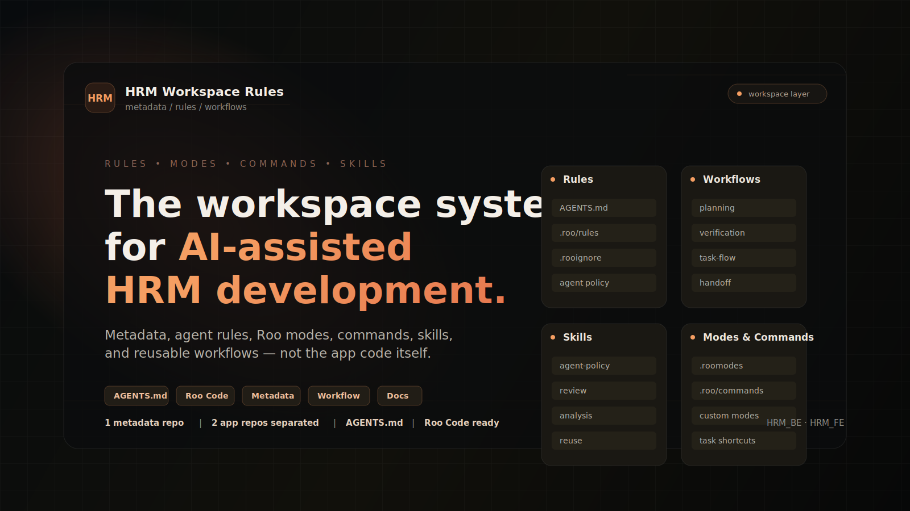
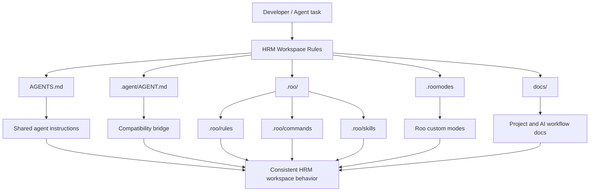
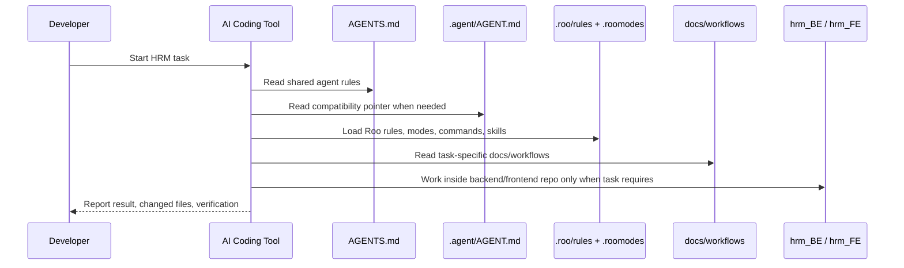
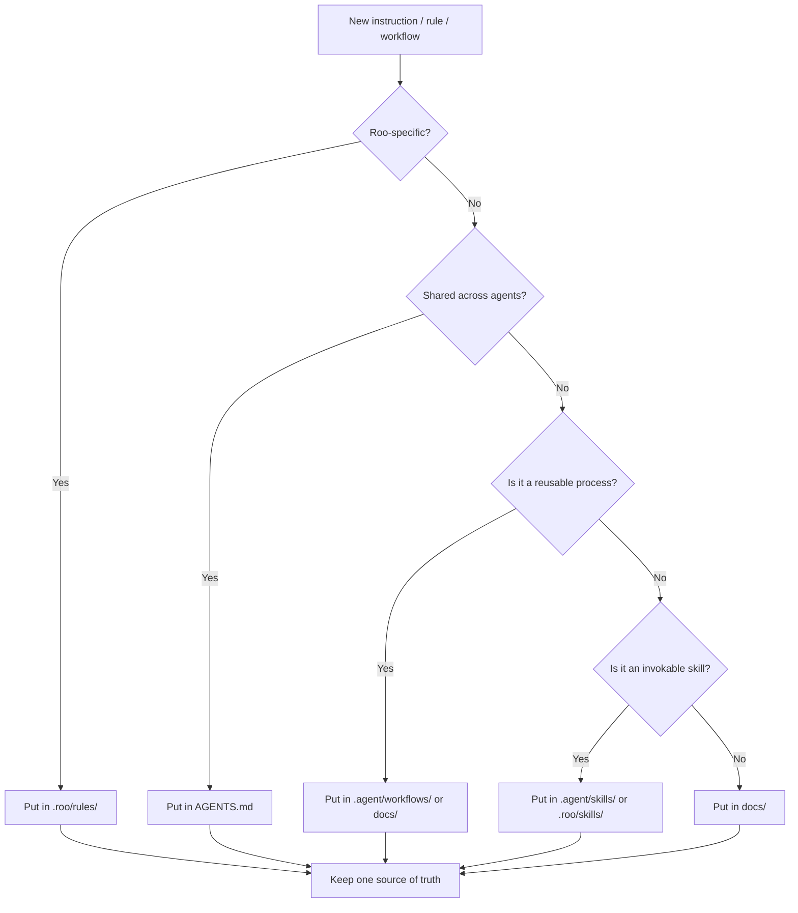

**Language / Ngôn ngữ**

[**Tiếng Việt**](#tiếng-việt) | [English](#english)

# HRM Workspace Rules




> **1 metadata repo** | **2 app repos separated** | **Agent rules** | **Roo modes** | **Reusable workflows**

---

<div align="center">

**Language / Ngôn ngữ**

[**Tiếng Việt**](#tiếng-việt) | [English](#english)

</div>

---

<a id="tiếng-việt"></a>

## Tiếng Việt

**HRM Workspace Rules** là repository dùng để version hóa tài liệu cấp workspace, agent rules, Roo Code modes, commands, skills và workflow dùng lại cho dự án HRM.

Repository này **không phải source code backend/frontend**. Source code ứng dụng nằm trong hai Git repository riêng:

- `hrm_BE/` — backend HRM
- `hrm_FE/` — frontend HRM

Root repository này chỉ quản lý **metadata, rules, documentation, workflow và cấu hình hỗ trợ AI agent**.

---

## Visual Overview



---

## Repository Map

```text
HRM workspace metadata repo (./)
├── README.md
│   ├── Tác dụng: entry point giải thích repo này dùng để làm gì
│   └── Được đọc bởi: developer/agent khi cần hiểu layout workspace
│
├── AGENTS.md
│   ├── Tác dụng: canonical agent rules cho HRM, compact nhưng self-contained
│   └── Được đọc bởi: Codex, Roo Code built-in loader, và agent hỗ trợ AGENTS.md
│
├── .agent/
│   ├── AGENT.md
│   │   ├── Tác dụng: bridge file, tránh copy lại rule
│   │   └── Được đọc bởi: tool/workflow dùng convention .agent/AGENT.md
│   ├── skills/
│   │   ├── Tác dụng: reusable skills cho agent
│   │   └── Được gọi bởi: agent khi skill được invoke thủ công hoặc qua workflow
│   └── workflows/
│       ├── Tác dụng: task workflow dùng lại cho HRM
│       └── Được gọi bởi: agent/developer khi cần workflow cụ thể
│
├── .roo/
│   ├── rules/
│   │   ├── Tác dụng: Roo workspace rules
│   │   └── Được load bởi: Roo Code cho mỗi task trong workspace
│   ├── commands/
│   │   ├── Tác dụng: Roo command templates
│   │   └── Được gọi bởi: Roo command UI / command workflow
│   └── skills/
│       ├── Tác dụng: Roo-specific skill prompts
│       └── Được gọi bởi: Roo khi user/mode chọn skill tương ứng
│
├── .roomodes
│   ├── Tác dụng: định nghĩa Roo custom modes, role, permissions, whenToUse
│   └── Được load bởi: Roo Code khi chọn mode
│
├── docs/
│   ├── Tác dụng: tài liệu project, AI workflow, ghi chú phân tích
│   └── Được đọc bởi: developer/agent theo nhu cầu
│
├── .rooignore
│   ├── Tác dụng: khai báo file/thư mục Roo nên bỏ qua
│   └── Được đọc bởi: Roo Code
│
├── .gitignore
│   ├── Tác dụng: bảo vệ root repo không track nhầm app repo/cache
│   └── Được đọc bởi: Git ở root repo
│
├── hrm_BE/  -> Git repo backend riêng, bị ignore ở root
└── hrm_FE/  -> Git repo frontend riêng, bị ignore ở root
```

---

## File Roles

| Path | Vai trò | Ai/Tool dùng |
|---|---|---|
| `README.md` | Overview cho người đọc, mô tả layout workspace | Developer, agent |
| `AGENTS.md` | Canonical agent rules cho HRM | Codex, Roo Code built-in loader, AGENTS.md-aware agents |
| `.agent/AGENT.md` | Bridge file cho workflow đọc `.agent/AGENT.md`, tránh duplicate rule | Legacy/custom agent workflow |
| `.agent/skills/` | Reusable skills cho agent | Agent khi skill được invoke |
| `.agent/workflows/` | Workflow dùng lại theo từng loại task HRM | Agent, developer |
| `.roo/rules/` | Rule chính cho Roo Code trong workspace | Roo Code |
| `.roo/commands/` | Roo command templates | Roo command UI / command workflow |
| `.roo/skills/` | Roo-specific skill prompts | Roo mode hoặc user-selected skill |
| `.roomodes` | Roo custom modes, role, permission, whenToUse | Roo Code |
| `docs/` | Project docs, AI workflow docs, ghi chú phân tích | Developer, agent |
| `.rooignore` | File/thư mục Roo nên bỏ qua | Roo Code |
| `.gitignore` | Chặn root repo track nhầm app repos/cache | Git |

---

## Git Layout

| Path | Mục đích | Cách quản lý Git |
|---|---|---|
| `./` | Workspace metadata, docs, rules, skills, modes | Repository này |
| `hrm_BE/` | Source code backend HRM | Git repository riêng |
| `hrm_FE/` | Source code frontend HRM | Git repository riêng |

Root `.gitignore` cố ý ignore `hrm_BE/` và `hrm_FE/` để repository metadata này không xung đột với repository backend/frontend.

---

## Rule Loading Flow



---

## What This Repository Tracks

Repository này nên track:

- `AGENTS.md`
- `.agent/`
- `.roo/`
- `.roomodes`
- `.rooignore`
- `docs/`
- Root-level documentation như `README.md`

Repository này không nên track:

- `hrm_BE/`
- `hrm_FE/`
- `.vscode/`
- `.pytest_cache/`
- Local cache
- Build output
- Secrets
- Generated files

---

## Working Rules

- Commit workspace rules và documentation từ root repository.
- Commit backend code changes bên trong `hrm_BE/`.
- Commit frontend code changes bên trong `hrm_FE/`.
- Không chạy root-level Git commands nếu mục tiêu là commit app code.
- Không bỏ ignore rules cho `hrm_BE/` và `hrm_FE/` trừ khi chủ động thiết kế lại repository layout.
- Không duplicate rule giữa `AGENTS.md`, `.agent/AGENT.md` và `.roo/rules/`.

---

## Agent Usage

| Tool / workflow | Entry point nên dùng |
|---|---|
| Codex và agent tương tự | `AGENTS.md` |
| Roo Code | `.roo/rules/`, `.roomodes`, `.roo/commands/`, `.roo/skills/` |
| Tool đọc `.agent/AGENT.md` | `.agent/AGENT.md` |
| Workflow hoặc task cụ thể | `.agent/workflows/`, `docs/` |

Ghi chú thực tế: `.agent/AGENT.md` chỉ nên là pointer/bridge file. Rule chính nên nằm ở nơi tool thật sự load, tránh copy nhiều nơi rồi về sau lệch nội dung.

---

## Where Should New Rules Live?



---

## Quick Mental Model

```text
README.md          = người đọc hiểu repo này là gì
AGENTS.md          = rule chung cho agent
.agent/AGENT.md    = bridge file, không duplicate rule
.roo/rules/        = rule chính cho Roo Code
.roomodes          = định nghĩa mode của Roo
.agent/workflows/  = quy trình làm task dùng lại
docs/              = tài liệu và ghi chú mở rộng
hrm_BE/, hrm_FE/   = app repo riêng, không track ở root
```

Layout này giữ source code HRM tách khỏi hệ thống workspace rules, đồng thời vẫn cho phép version và review các file AI workflow.

---

<a id="english"></a>

## English

<details>
<summary>English version</summary>

## Overview

**HRM Workspace Rules** stores workspace-level documentation, agent rules, Roo Code modes, commands, skills, and reusable workflow guidance for the HRM project.

This is **not** the source repository for the HRM backend or frontend application code. The application code lives in separate Git repositories:

- `hrm_BE/` — HRM backend
- `hrm_FE/` — HRM frontend

Use this root repository to version files that describe how agents and developers should work with the HRM workspace.

---

## Visual Overview


---

## Repository Map

```text
HRM workspace metadata repo (./)
├── README.md
│   ├── Purpose: entry point that explains what this repository is for
│   └── Read by: developers/agents that need to understand the workspace layout
│
├── AGENTS.md
│   ├── Purpose: canonical HRM agent rules, compact but self-contained
│   └── Read by: Codex, Roo Code built-in loader, and AGENTS.md-aware agents
│
├── .agent/
│   ├── AGENT.md
│   │   ├── Purpose: bridge file that avoids duplicating rules
│   │   └── Read by: tools/workflows that use the .agent/AGENT.md convention
│   ├── skills/
│   │   ├── Purpose: reusable agent skills
│   │   └── Called by: agents when a skill is invoked manually or through a workflow
│   └── workflows/
│       ├── Purpose: reusable HRM task workflows
│       └── Called by: agents/developers when a specific workflow is needed
│
├── .roo/
│   ├── rules/
│   │   ├── Purpose: Roo workspace rules
│   │   └── Loaded by: Roo Code for every task in the workspace
│   ├── commands/
│   │   ├── Purpose: Roo command templates
│   │   └── Called by: Roo command UI / command workflow
│   └── skills/
│       ├── Purpose: Roo-specific skill prompts
│       └── Called by: Roo when the user/mode selects the matching skill
│
├── .roomodes
│   ├── Purpose: Roo custom modes, roles, permissions, and whenToUse metadata
│   └── Loaded by: Roo Code when a mode is selected
│
├── docs/
│   ├── Purpose: project docs, AI workflow docs, and analysis notes
│   └── Read by: developers/agents as needed
│
├── .rooignore
│   ├── Purpose: files/directories Roo should ignore
│   └── Read by: Roo Code
│
├── .gitignore
│   ├── Purpose: prevents the root repo from tracking app repos/cache by mistake
│   └── Read by: Git at the root repository
│
├── hrm_BE/  -> separate backend Git repository, ignored at root
└── hrm_FE/  -> separate frontend Git repository, ignored at root
```

---

## Important Files

| Path | Purpose | Used by |
|---|---|---|
| `README.md` | Human-facing overview of the workspace metadata repo | Developers, agents |
| `AGENTS.md` | Canonical HRM agent rules | Codex, Roo Code built-in loader, AGENTS.md-aware agents |
| `.agent/AGENT.md` | Bridge file for tools that read `.agent/AGENT.md` | Legacy/custom agent workflows |
| `.agent/skills/` | Reusable agent skills | Agents |
| `.agent/workflows/` | Reusable HRM task workflows | Agents, developers |
| `.roo/rules/` | Main Roo Code workspace rules | Roo Code |
| `.roo/commands/` | Roo command templates | Roo command UI / command workflow |
| `.roo/skills/` | Roo-specific skill prompts | Roo Code |
| `.roomodes` | Roo custom modes, roles, permissions, and whenToUse | Roo Code |
| `docs/` | Project docs, AI workflow docs, and analysis notes | Developers, agents |
| `.rooignore` | Files/directories Roo should ignore | Roo Code |
| `.gitignore` | Prevents root repo from tracking app repos/cache by mistake | Git |

---

## Git Layout

| Path | Purpose | Git handling |
|---|---|---|
| `./` | Workspace metadata, docs, rules, skills, modes | This repository |
| `hrm_BE/` | HRM backend source code | Separate Git repository |
| `hrm_FE/` | HRM frontend source code | Separate Git repository |

The root `.gitignore` intentionally excludes `hrm_BE/` and `hrm_FE/` so this metadata repository does not conflict with the backend/frontend repositories.

---

## What This Repository Tracks

This repository should track:

- `AGENTS.md`
- `.agent/`
- `.roo/`
- `.roomodes`
- `.rooignore`
- `docs/`
- Root-level documentation such as `README.md`

This repository should not track:

- `hrm_BE/`
- `hrm_FE/`
- `.vscode/`
- `.pytest_cache/`
- Local cache
- Build output
- Secrets
- Generated files

---

## Working Rules

- Commit workspace rules and documentation from the root repository.
- Commit backend code changes inside `hrm_BE/`.
- Commit frontend code changes inside `hrm_FE/`.
- Do not run root-level Git commands when the intent is to commit app code.
- Do not remove the `hrm_BE/` and `hrm_FE/` ignore rules unless the repository layout is intentionally redesigned.
- Do not duplicate rules between `AGENTS.md`, `.agent/AGENT.md`, and `.roo/rules/`.

---

## Agent Usage

| Tool / workflow | Recommended entry point |
|---|---|
| Codex and similar agents | `AGENTS.md` |
| Roo Code | `.roo/rules/`, `.roomodes`, `.roo/commands/`, `.roo/skills/` |
| Tools reading `.agent/AGENT.md` | `.agent/AGENT.md` |
| Specific reusable workflows | `.agent/workflows/`, `docs/` |

Practical note: `.agent/AGENT.md` should stay as a pointer/bridge file. Main rules should live where the tool actually loads them to avoid stale duplicated content.

</details>
