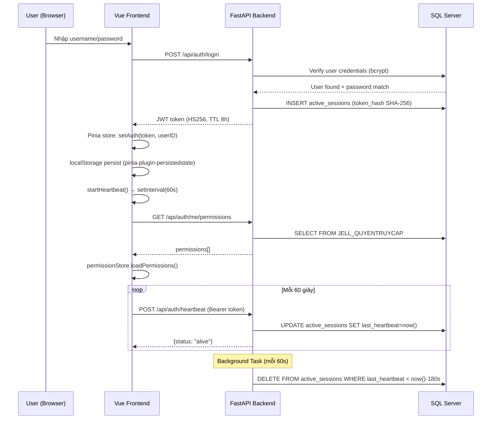
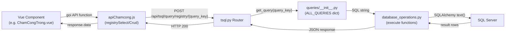
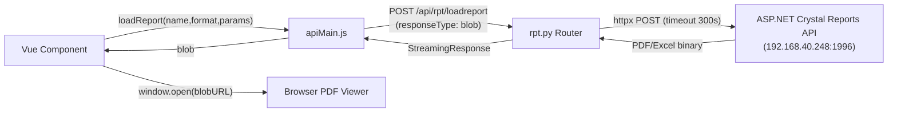
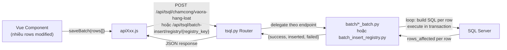
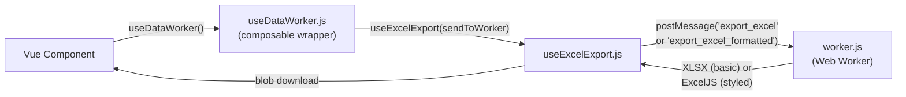

# HRM Project - Implementation Details

> Auto-generated bởi `/autodocs` workflow
> Cập nhật lần cuối: 2026-05-25

---

## Tech Stack

| Layer            | Technology              | Version/Note                                           |
| ---------------- | ----------------------- | ------------------------------------------------------ |
| **Frontend**     | Vue 3 + Composition API | `<script setup>`                                       |
| **UI Framework** | Element Plus            | `el-*` components (Vuetify đã gỡ hoàn toàn 2026-04-13) |
| **State**        | Pinia + persistedstate  | `authStores.js`, `permissionStore.js`                  |
| **Router**       | Vue Router              | `router/index.ts`                                      |
| **Build**        | Vite                    | `vite.config.mjs`                                      |
| **Date**         | date-fns                | `format()`                                             |
| **Backend**      | Python FastAPI          | `main.py`                                              |
| **ORM**          | SQLAlchemy 2.0          | `database.py`                                          |
| **Database**     | SQL Server              | Via pyodbc + registry query system                     |
| **Auth**         | JWT (HS256) + Bcrypt    | `python-jose`, `passlib`                               |
| **Deploy**       | Docker                  | `Dockerfile` + `docker-compose.yml`                    |

---

## Architecture Patterns & Techniques

### Design Patterns

| Pattern                      | Áp dụng               | Files chính                                                      | Mô tả                                                                                                                                            |
| ---------------------------- | --------------------- | ---------------------------------------------------------------- | ------------------------------------------------------------------------------------------------------------------------------------------------ |
| **Query Registry**           | Backend SQL           | `queries/__init__.py`, `queries/*_queries.py`, `routers/tsql.py` | SQL queries định nghĩa tập trung trong Python files, mapping qua `ALL_QUERIES` dict. Frontend chỉ gửi `query_key` → ngăn SQL injection           |
| **Service Layer**            | Backend DB ops        | `services/database_operations.py`                                | Tách riêng logic DB (SP execution, raw query, pagination) khỏi routers. 586 dòng, 8 core functions                                               |
| **Dependency Injection**     | Backend auth          | `security.py` → `Depends(get_current_user)`, `Depends(get_db)`   | FastAPI Depends pattern cho auth và DB session                                                                                                   |
| **Composition API**          | Frontend components   | Tất cả 60+ `.vue` files                                          | `<script setup>` + `ref()`, `reactive()`, `computed()`, `onMounted()`                                                                            |
| **Centralized API Layer**    | Frontend HTTP         | `apis/apiXxx.js`                                                 | Mỗi module 1 file API, wrap axios calls. Components không gọi axios trực tiếp                                                                    |
| **Pinia Persistence**        | Frontend state        | `authStores.js`                                                  | Token + userID persist vào localStorage, auto restore khi reload                                                                                 |
| **Permission-based Routing** | Frontend nav          | `router/index.ts`, `permissionStore.js`                          | Route guards check permission từ `permissionsMap` trước khi render                                                                               |
| **Batch Processing**         | Backend bulk ops      | `batch/*.py`                                                     | Gom nhiều rows thành 1 request, xử lý hàng loạt (300 rows/2-5s)                                                                                  |
| **Batch Insert Registry**    | Backend generic batch | `batch/batch_insert_registry.py`                                 | Registry pattern cho batch inserts, tương tự Query Registry                                                                                      |
| **Web Worker**               | Frontend Excel        | `workers/worker.js`, `useExcelExport.js`, `useDataWorker.js`     | Excel export/import/read chạy trong Worker thread, không block UI. Hỗ trợ formatted export (ExcelJS styling, totalRow, footerRows, numberingRow) |
| **Heartbeat Session**        | Auth management       | `security.py`, `session_cleanup.py`, `authStores.js`             | Client gửi heartbeat 60s, server cleanup session > 3 phút không active                                                                           |
| **Interceptor Pattern**      | Frontend errors       | `axiosInterceptor.js`                                            | Centralized HTTP error handling: 401→logout, 403→reload permissions                                                                              |
| **Audit Trail**              | Backend logging       | `models.py` (`AuditLog`), `security.py` (`log_audit()`)          | Log mọi CRUD + report action với user, IP, timestamp                                                                                             |
| **Memory Pagination**        | Backend paginate      | `database_operations.py`                                         | Load ALL data once, pagination in Python. Suitable for ≤ 20k rows                                                                                |

### Data Flow Diagrams

#### Authentication Flow



#### CRUD Data Flow (Query Registry Pattern)



#### Report Flow



#### Batch Processing Flow



#### Worker Flow (Excel)



### Frontend Architecture

| Aspect            | Technique                                                                                                                                                                 | Files                                               |
| ----------------- | ------------------------------------------------------------------------------------------------------------------------------------------------------------------------- | --------------------------------------------------- |
| Component pattern | `<script setup>` Composition API                                                                                                                                          | Tất cả 65+ `.vue` files                             |
| State management  | Pinia + `pinia-plugin-persistedstate`                                                                                                                                     | `stores/*.js`                                       |
| API layer         | Centralized modules, mỗi module 1 file                                                                                                                                    | `apis/apiXxx.js` (7 files)                          |
| UI framework      | Element Plus (`el-*`)                                                                                                                                                     | Vuetify đã gỡ hoàn toàn (2026-04-13)                |
| Routing           | Permission-based guards (`beforeEach` + `beforeEnter`), **lazy loading** (64 dynamic imports)                                                                             | `router/index.ts`                                   |
| i18n              | `vue-i18n` (vi/zh)                                                                                                                                                        | `locales/`, `Login.vue`                             |
| Performance       | Web Workers (Excel), `debounce`/`throttle` (search)                                                                                                                       | `workers/`, `utils/function.js`                     |
| Loading/Toast     | `showLoading`/`hideLoading`, `Success`/`Error`                                                                                                                            | `utils/LoadingView.js`                              |
| Excel export      | `useDataWorker()` composable wraps worker + `useExcelExport()`. Supports basic (`export_excel` XLSX) and formatted (`export_excel_formatted` ExcelJS with styling/merges) | `utils/useDataWorker.js`, `utils/useExcelExport.js` |
| HTTP interceptor  | Centralized 401/403/500 handling                                                                                                                                          | `utils/axiosInterceptor.js`                         |
| Proxy             | Nginx reverse proxy (`/api/` → backend)                                                                                                                                   | `axiosInterceptor.js` uses relative `/api/`         |
| Theme System      | Tailwind v4 `@theme` tokens (53 semantic vars), `color-mix()`, zero hardcoded colors                                                                                      | `styles/tailwind.css` (single source of truth)      |
| Dark Mode         | CSS var overrides + EP component overrides + early FOUC prevention                                                                                                        | `tailwind.css` `html.dark {}` + `index.html` script |

### Backend Architecture

| Layer              | Mô tả                                                   | Files                                            | Lines     |
| ------------------ | ------------------------------------------------------- | ------------------------------------------------ | --------- |
| **Routers**        | HTTP endpoints, request validation, response formatting | `routers/*.py` (5 files)                         | ~1555     |
| **Services**       | DB operations, query execution, pagination, export      | `services/database_operations.py`                | 586       |
| **Query Registry** | SQL defined in Python, mapped by key                    | `queries/*.py` (27 files), `queries/__init__.py` | ~3KB init |
| **Batch Handlers** | Bulk operation processors                               | `batch/*.py` (4 files)                           | ~51KB     |
| **Security**       | JWT, bcrypt, session management, permissions, audit     | `security.py`                                    | 212       |
| **Models**         | SQLAlchemy ORM models                                   | `models.py`                                      | 51        |
| **Schemas**        | Pydantic request/response validation                    | `schemas.py`                                     | 76        |
| **Database**       | SQLAlchemy engine, session factory, `get_db()`          | `database.py`                                    | —         |
| **Background**     | Async tasks (session cleanup every 60s)                 | `session_cleanup.py`                             | —         |
| **Middleware**     | Rate limiting, CORS (env-based origins)                 | `middleware/rate_limiter.py`, `main.py`          | —         |

### Security Architecture

| Aspect            | Implementation                                                   | Config                                                |
| ----------------- | ---------------------------------------------------------------- | ----------------------------------------------------- |
| **JWT**           | HS256 algorithm, `python-jose`                                   | TTL: 8 giờ (480 phút)                                 |
| **Password**      | bcrypt via `passlib.CryptContext`                                | Auto salt                                             |
| **Session**       | Heartbeat-based tracking                                         | 60s heartbeat, 180s timeout                           |
| **Token in DB**   | SHA-256 hash in `active_sessions` table                          | `hash_token()` — không lưu raw token                  |
| **Permission**    | Table `JELL_QUYENTRUYCAP` (`Allow`, `Them`, `Sua`, `Xoa`)        | Check cả FE guard + BE `check_permission_from_db()`   |
| **SQL injection** | Parameterized queries (`:param`) + Query Registry                | Frontend không gửi raw SQL                            |
| **Rate limiting** | Middleware `rate_limiter.py`                                     | Per-IP limits                                         |
| **CORS**          | Env-based `CORS_ORIGINS` in `main.py`                            | Dev: localhost defaults; Prod: set via env/docker     |
| **Audit**         | `AuditLog` model, `log_audit()` helper                           | Log mọi CRUD + REPORT action                          |
| **Avatar**        | Network share `\\192.168.40.246\HinhNV` or Docker `/app/avatars` | Env `AVATAR_PATH`, public (no auth), case-insensitive |

### Error Handling Patterns

**Frontend (Vue Component):**

```javascript
try {
  showLoading(); // Hiện loading overlay
  const res = await apiFunction(params); // Gọi API
  // Xử lý response...
  Success("Thành công!"); // ElMessage success
} catch (error) {
  console.error("Context:", error);
  Error("Có lỗi xảy ra."); // ElMessage error
} finally {
  hideLoading(); // Tắt loading overlay
}
```

**Backend (FastAPI):**

```python
# Router level
raise HTTPException(status_code=401, detail="Token expired")

# Service level - return structured response
return {"status": "error", "message": "...", "rows_affected": 0}

# Audit logging cho mọi action
log_audit(user_id, username, action, resource_type, resource_id, ip, details, db)
```

**Interceptor (Axios) - `axiosInterceptor.js`:**

- `401` → Nếu heartbeat: authStore xử lý (clearAuth + redirect). Nếu khác: `clearAuth()` + redirect `/Login`
- `403` → Thông báo không có quyền
- `500` → Thông báo lỗi server

### API Response Check Conventions

| Endpoint Type                     | Check Pattern                                               | Ví dụ                         |
| --------------------------------- | ----------------------------------------------------------- | ----------------------------- |
| `procedure/select`                | `response.data?.data?.length > 0`                           | Load danh sách SP             |
| `query/registry/{query_key}`      | `response.data?.data?.length > 0`                           | Registry SELECT               |
| `query/registry/{query_key}/crud` | `response.data?.rows_affected > 0`                          | Registry INSERT/UPDATE/DELETE |
| `batch-insert/registry/{key}`     | `response.data?.success && response.data?.rowsInserted > 0` | Batch insert qua registry     |
| Luôn dùng                         | Optional chaining: `response.data?.data?.length`            | Tránh null reference          |

### Known Design Decisions & Gotchas

| #   | Quyết định / Gotcha                          | Lý do                                                                             | Ảnh hưởng                                                                             |
| --- | -------------------------------------------- | --------------------------------------------------------------------------------- | ------------------------------------------------------------------------------------- |
| 1   | ~~**Vuetify đã gỡ hoàn toàn**~~ (2026-04-13) | Vuetify đã bị gỡ bỏ, icons chuyển sang `@element-plus/icons-vue`                  | `plugins/index.js` là empty shell, bundle giảm ~300KB                                 |
| 2   | **Query Registry thay vì ORM**               | Legacy SQL Server SPs + complex queries không phù hợp ORM thuần                   | Queries nằm trong Python strings, khó unit test                                       |
| 3   | **Heartbeat thay vì Redis session**          | Project chưa có Redis infrastructure                                              | Session data trong SQL Server, cleanup qua background task                            |
| 4   | **No "Remember Me"**                         | Heartbeat design: đóng browser = session expire                                   | User bắt buộc login lại khi mở browser                                                |
| 5   | **Token TTL 8h là backup**                   | Heartbeat là cơ chế chính, TTL 8h phòng edge case                                 | Nếu cleanup task không chạy, token vẫn expire sau 8h                                  |
| 6   | **Permission code format**                   | Dạng `1frmXxxYyy` (prefix `1frm` + tên form VB.NET gốc)                           | Giữ backward compatibility với DB quyền VB.NET                                        |
| 7   | **Large components**                         | Một số file > 60KB (ChamCongTrong 68KB, ChuaKyHDLD 76KB, CapNhatHoSoNhanSu 107KB) | Cần refactor tách child components                                                    |
| 8   | **sys.py lookup endpoints public**           | Lookup tĩnh (tỉnh thành, dân tộc...) public; org data (đơn vị, khu) đã thêm auth  | 16 lookup endpoints public, 5 org endpoints đã có auth (2026-04-13)                   |
| 9   | **Memory pagination**                        | Load ALL data + paginate in Python                                                | Chỉ phù hợp ≤ 20k rows                                                                |
| 10  | ~~**users.py filter by username**~~          | ✅ ĐÃ FIX (2026-04-13): sửa `User.username == user_id` → `User.id == user_id`     | Đã sửa ở cả 3 chỗ: get, update, delete                                                |
| 11  | ~~**Register endpoint disabled**~~           | ✅ ĐÃ MỞ LẠI (2026-04-22): endpoint yêu cầu JWT token (Depends(get_current_user)) | `POST /auth/register` re-enabled với auth guard (2026-04-22)                          |
| 12  | **Lazy loading routes**                      | Giảm initial bundle size, Vite tách mỗi page thành chunk riêng (2026-05-13)       | 64 dynamic imports `() => import(...)`, 4 core static (Layout, Login, Guide, General) |
| 13  | **CORS env-based**                           | `allow_origins=["*"]` → env `CORS_ORIGINS` (2026-05-13)                           | Dev: localhost defaults; Prod: set `CORS_ORIGINS` trong docker-compose                |
| 14  | ~~**axiosConfig.js**~~ (2026-05-13)          | ✅ ĐÃ XÓA: dead code, chức năng đã có trong `axiosInterceptor.js`                 | Xóa file thừa, giảm confusion                                                         |
| 15  | **CodeGraph MCP servers** (2026-05-25)       | 2 MCP servers `codegraph-fe` / `codegraph-be` trong `.roo/mcp.json`, chạy `codegraph serve --mcp` tại `hrm_FE` / `hrm_BE` | Dùng bởi mode `ask-codegraph` để phân tích dependency/impact mà không cần đọc file thủ công |
| 16  | **`ask-codegraph` mode** (2026-05-25)        | Mode read-only dùng CodeGraph MCP tools để trace callers, callees, imports, exports, và affected files | Không edit file; output: Target → Direct deps → Reverse deps → Affected areas → Risk level → Suggested verification |

---

## Project Tree

```
HRM/
├── docs/
│   ├── implements.md                    # (this file - single source of truth)
│   └── heartbeat_session_management.md
│
├── .roo/
│   ├── mcp.json                         # MCP server config: context7, playwright, codegraph-fe, codegraph-be
│   ├── commands/                        # Slash commands: /autodocs, /exportMarkdown
│   ├── rules/                           # Core rules: superpowers-hrm-core, verification
│   ├── skills/                          # Skills: debugging, planning, review, tdd
│   └── rules-*/                         # Mode-specific rule files
│
├── hrm_BE/                              # Backend (FastAPI)
│   ├── main.py                          # App entry + startup events
│   ├── pytest.ini                       # Pytest config
│   ├── requirements.txt                 # 12 Python dependencies
│   ├── Dockerfile / docker-compose.yml
│   ├── .env                             # Dev environment
│   ├── app/
│   │   ├── __init__.py
│   │   ├── database.py                  # SQLAlchemy engine + get_db()
│   │   ├── models.py                    # User, Permission, ActiveSession, AuditLog
│   │   ├── schemas.py                   # 9 Pydantic schemas
│   │   ├── security.py                  # JWT, bcrypt, session, permissions, audit (212 lines)
│   │   ├── session_cleanup.py           # Background cleanup expired sessions
│   │   ├── routers/
│   │   │   ├── auth.py                  # /api/auth/* (10 endpoints, 298 lines)
│   │   │   ├── tsql.py                  # /api/tsql/* (18 endpoints, 949 lines)
│   │   │   ├── sys.py                   # /api/sys/*  (22 endpoints, 269 lines)
│   │   │   ├── rpt.py                   # /api/rpt/*  (1 endpoint, 111 lines)
│   │   │   └── users.py                 # /api/users/* (4 endpoints, 99 lines)
│   │   ├── queries/                     # 27 SQL query definition files
│   │   │   ├── __init__.py              # Query registry (ALL_QUERIES mapping)
│   │   │   ├── chamcongtrong_queries.py    # 78KB
│   │   │   ├── hopdonglaodong_queries.py   # 20KB
│   │   │   ├── nghiphep_queries.py         # 16KB
│   │   │   ├── binhbautong_queries.py      # 16KB
│   │   │   ├── diemdanhhangngay_queries.py # 15KB
│   │   │   ├── chuakyhopdong_queries.py    # 14KB
│   │   │   ├── chamcongngoai_queries.py    # 12KB
│   │   │   ├── capnhatkcb_queries.py       # 11KB
│   │   │   ├── dienbienluong_queries.py    # 11KB
│   │   │   ├── capnhathosonhansu_queries.py # 10KB
│   │   │   ├── tinhluongchinh_queries.py   # 8KB
│   │   │   └── ... (28 smaller files)
│   │   ├── batch/
│   │   │   ├── batch_insert_registry.py # 9KB - Generic batch insert
│   │   │   ├── diemdanh_batch.py        # 21KB - Batch điểm danh
│   │   │   ├── editvaora_batch.py       # 15KB - Batch vào ra trong
│   │   │   ├── editvaorangoai_batch.py  # 13KB - Batch vào ra ngoài
│   │   │   └── tangluong_batch.py       # 12KB - Batch tăng lương
│   │   ├── middleware/
│   │   │   └── rate_limiter.py
│   │   ├── services/
│   │   │   └── database_operations.py   # 586 lines, 8 core functions
│   │   └── utils/
│   └── tests/
│       ├── conftest.py                  # SQLite in-memory fixtures
│       └── test_heartbeat.py            # 15 tests
│
├── hrm_FE/                              # Frontend (Vue 3)
│   └── src/
│       ├── main.js                      # App bootstrap
│       ├── App.vue
│       ├── apis/
│       │   ├── apiMain.js               # 3.9KB - Base utils + system lookups + report
│       │   ├── apiLogin.js              # 1KB - login, changepassword, heartbeat
│       │   ├── apiChamcong.js           # 33KB - Chấm công APIs
│       │   ├── apiNhansu.js             # 58KB - Nhân sự APIs
│       │   ├── apiDanhgia.js            # 6KB - Đánh giá APIs
│       │   ├── apiBaocao.js             # 10KB - Báo cáo APIs (TKKSK, TKDBL, TCTTTGBH, CNSSBH, NGHIOPTHANG, TKLVTTGT, TINHTCTV, ThongKeGuiKH, ImportBHXH) — 30 functions
│       │   └── apiTinhluong.js          # 27KB - Tính lương APIs
│       ├── components/
│       │   ├── General.vue / Guide.vue / Basic.vue
│       │   ├── CHAMCONG/    (8 files)
│       │   ├── NHANSU/      (19 files + NghiPhep/ 5 files)
│       │   ├── DANHGIA/     (5 files)
│       │   ├── BAOCAO/      (17 files + Dialogs/ 1 file)
│       │   ├── HETHONG/     (1 file)
│       │   └── TINHLUONG/   (19 files + Dialogs/ 2 files)
│       ├── stores/
│       │   ├── authStores.js            # 186 lines - Auth + heartbeat
│       │   └── permissionStore.js       # 80 lines - Permission RBAC
│       ├── utils/
│       │   ├── axiosInterceptor.js      # 2.4KB - 401/403/500 handling
│       │   ├── LoadingView.js           # 1.8KB - showLoading/hideLoading/Success/Error
│       │   ├── function.js              # 1.4KB - debounce, throttle
│       │   ├── useExcelExport.js        # 6KB - Excel export composable (basic + formatted)
│       │   ├── useDataWorker.js         # 2.6KB - Web Worker composable (wraps useExcelExport)
│       │   ├── excelHelpers.js          # 4.6KB - Excel format + transform helpers
│       │   └── validated.js             # 1.0KB - Validation helpers
│       ├── views/
│       │   ├── Grid.vue                 # 15KB - Basic grid
│       │   ├── MultiSelectGrid.vue      # 29KB - Multi-select grid (el-table-v2, cellClass prop)
│       │   ├── GridWithRowSpan.vue      # 28KB - Grid with row span-method (el-table v1, cell merging)
│       │   ├── PdfViewer.vue            # 1.2KB - PDF viewer
│       │   └── Main.vue                 # 1.3KB
│       ├── Layout/
│       │   ├── index.vue                # 2.4KB - Main layout wrapper
│       │   ├── Header.vue               # 4.1KB - Top bar
│       │   ├── Sidemenu.vue             # 30KB - Side navigation
│       │   └── Login.vue                # 11KB - Login page
│       ├── router/index.ts              # 470 lines - Routes + guards + lazy loading (64 dynamic imports)
│       ├── workers/worker.js            # 20KB - Excel web worker (6 actions, ExcelJS formatted export + totalRow/footerRows/numberingRow)
│       ├── locales/ (vi.js, zh.js)
│       ├── plugins/ (index.js, vuetify.js)
│       ├── services/reportService.js
│       └── styles/
│           └── tailwind.css          # Theme tokens: 53 semantic CSS vars (light+dark), EP overrides, component classes
```

---

## Backend Details

### Database Models

| Model           | Table               | Columns                                                                                                                                            | Mô tả                        |
| --------------- | ------------------- | -------------------------------------------------------------------------------------------------------------------------------------------------- | ---------------------------- |
| `User`          | `users`             | `id` (PK), `username` (unique, max 50), `password_hash` (255), `full_name` (Unicode 100)                                                           | Tài khoản đăng nhập          |
| `Permission`    | `JELL_QUYENTRUYCAP` | `Ma_DM` (PK), `Ten_DangNhap`, `Allow`, `Them`, `Sua`, `Xoa`                                                                                        | Quyền truy cập theo module   |
| `ActiveSession` | `active_sessions`   | `id` (PK), `username`, `token_hash` (64, unique), `last_heartbeat`, `created_at`, `ip_address` (45), `user_agent` (255)                            | Session tracking (heartbeat) |
| `AuditLog`      | `audit_logs`        | `id` (PK), `user_id`, `username`, `action` (50), `resource_type` (50), `resource_id` (Text), `timestamp`, `ip_address` (45), `details` (Text/JSON) | Audit trail                  |

### Pydantic Schemas

| Schema                    | Fields                                                                            | Dùng cho                   |
| ------------------------- | --------------------------------------------------------------------------------- | -------------------------- |
| `UserLogin`               | `username` (max 6), `password` (min 1)                                            | POST /auth/login           |
| `UserRegister`            | `username` (max 6), `password` (min 6), `confirm_password`, `full_name` (max 100) | POST /auth/register        |
| `UserForgotPassword`      | `username` (max 6), `new_password` (min 6), `confirm_password`                    | POST /auth/forgot-password |
| `UserChangePassword`      | `password` (min 1), `new_password` (min 6), `confirm_password`                    | POST /auth/changepassword  |
| `Token`                   | `access_token`, `token_type`                                                      | Login response             |
| `UserResponse`            | `id`, `username`, `full_name`                                                     | User info response         |
| `PermissionResponse`      | `Ma_DM`, `Ten_DangNhap`, `Allow`, `Them`, `Sua`, `Xoa`                            | Permission item            |
| `UserPermissionsResponse` | `id`, `username`, `full_name`, `permissions[]`                                    | User + permissions         |
| `HeartbeatResponse`       | `status`, `message` (optional)                                                    | Heartbeat response         |

### API Endpoints

#### Auth Router (`/api/auth`) — 10 endpoints

| Method | Path                       | Auth      | Mô tả                                                       |
| ------ | -------------------------- | --------- | ----------------------------------------------------------- |
| POST   | `/login`                   | ❌        | Đăng nhập → JWT + tạo ActiveSession                         |
| POST   | `/register`                | ✅ Bearer | Tạo user mới (re-enabled 2026-04-22, yêu cầu token)         |
| POST   | `/logout`                  | ✅ Bearer | Đăng xuất → xóa ActiveSession                               |
| POST   | `/heartbeat`               | ✅ Bearer | Heartbeat giữ session alive (60s)                           |
| POST   | `/forgot-password`         | ❌        | Đổi mật khẩu (public cho user tự reset)                     |
| POST   | `/changepassword`          | ✅ Bearer | Đổi mật khẩu (auth, verify old password) — added 2026-04-18 |
| GET    | `/me`                      | ✅ Bearer | Thông tin user hiện tại                                     |
| GET    | `/me/permissions`          | ✅ Bearer | Quyền user hiện tại                                         |
| GET    | `/permissions/{username}`  | ✅ Bearer | Quyền theo username (auth added 2026-04-13)                 |
| GET    | `/share/avatars/{user_id}` | ❌        | Ảnh đại diện (public, case-insensitive — fixed 2026-04-18)  |

#### TSQL Router (`/api/tsql`) — 18 endpoints

| Method | Path                                     | Mô tả                                   |
| ------ | ---------------------------------------- | --------------------------------------- |
| POST   | `/procedure/select`                      | Chạy stored procedure SELECT            |
| POST   | `/excel-export`                          | Xuất Excel data (service layer)         |
| POST   | `/worker-load`                           | Worker load dữ liệu                     |
| POST   | `/procedure/select-pagination`           | SP SELECT + phân trang memory           |
| POST   | `/procedure/crud`                        | Chạy stored procedure CRUD              |
| POST   | `/query/select`                          | Raw SQL SELECT                          |
| GET    | `/query/registry`                        | Liệt kê query keys trong Query Registry |
| POST   | `/query/registry/{query_key}`            | Registry SELECT                         |
| POST   | `/query/registry/{query_key}/crud`       | Registry CRUD                           |
| POST   | `/query/registry/{query_key}/pagination` | Registry SELECT + phân trang memory     |
| POST   | `/query/select-pagination`               | Raw SQL SELECT + phân trang memory      |
| POST   | `/query/crud`                            | Raw SQL INSERT/UPDATE/DELETE            |
| POST   | `/diemdanh/luu-hang-loat`                | Batch điểm danh hàng ngày               |
| POST   | `/tangluong/luu-du-lieu-hang-loat`       | Batch tăng lương                        |
| POST   | `/chamcong/vaora-hang-loat`              | Batch vào ra (chấm công trong)          |
| POST   | `/chamcong/vaorangoai-hang-loat`         | Batch vào ra ngoài                      |
| GET    | `/batch-insert/registry`                 | Liệt kê batch insert keys               |
| POST   | `/batch-insert/registry/{registry_key}`  | Batch insert theo Batch Insert Registry |

> Tất cả endpoints TSQL yêu cầu ✅ Bearer auth.

#### System Router (`/api/sys`) — 22 endpoints

| Method | Path                 | Auth | Mô tả                                       |
| ------ | -------------------- | ---- | ------------------------------------------- |
| POST   | `/writelog`          | ✅   | Ghi audit log                               |
| GET    | `/loadtinhthanh`     | ❌   | Load tỉnh thành                             |
| GET    | `/loadquanhuyen`     | ❌   | Load quận huyện                             |
| GET    | `/loadxa`            | ❌   | Load xã                                     |
| GET    | `/loadtinhthanhnew`  | ❌   | Load tỉnh thành (bảng mới)                  |
| GET    | `/loadxanew`         | ❌   | Load xã (bảng mới)                          |
| GET    | `/loadtableSTDONVI`  | ✅   | Load đơn vị (auth added 2026-04-13)         |
| GET    | `/loadtableSTNXUONG` | ✅   | Load nhà xưởng (auth added 2026-04-13)      |
| GET    | `/loadtableSTNGANH`  | ✅   | Load ngành (auth added 2026-04-13)          |
| GET    | `/loadtableSTKHU`    | ✅   | Load khu (auth added 2026-04-13)            |
| GET    | `/loadchuyenmon`     | ❌   | Load chuyên môn                             |
| GET    | `/loadcongviec`      | ❌   | Load công việc                              |
| GET    | `/loadchucvu`        | ❌   | Load chức vụ                                |
| GET    | `/loadquoctich`      | ❌   | Load quốc tịch                              |
| GET    | `/loaddantoc`        | ❌   | Load dân tộc                                |
| GET    | `/loadmoiqh`         | ❌   | Load mối quan hệ                            |
| GET    | `/loadchuho`         | ❌   | Load chủ hộ                                 |
| GET    | `/loadtongiao`       | ❌   | Load tôn giáo                               |
| GET    | `/loadhocvan`        | ❌   | Load học vấn                                |
| GET    | `/loadngoaingu`      | ❌   | Load ngoại ngữ                              |
| GET    | `/loadtinhoc`        | ❌   | Load tin học                                |
| GET    | `/getmaxnv_ma`       | ✅   | Lấy mã NV tiếp theo (auth added 2026-04-13) |

#### Report Router (`/api/rpt`) — 1 endpoint

| Method | Path          | Auth | Mô tả                                                                    |
| ------ | ------------- | ---- | ------------------------------------------------------------------------ |
| POST   | `/loadreport` | ✅   | Load Crystal Reports qua ASP.NET API (192.168.40.248:1996, timeout 300s) |

#### Users Router (`/api/users`) — 4 endpoints

| Method | Path         | Auth | Mô tả                                                |
| ------ | ------------ | ---- | ---------------------------------------------------- |
| GET    | `/`          | ✅   | Danh sách users (phân trang) (auth added 2026-04-13) |
| GET    | `/{user_id}` | ✅   | User theo ID (auth + bug fix 2026-04-13)             |
| PUT    | `/{user_id}` | ✅   | Cập nhật full_name (bug fix 2026-04-13)              |
| DELETE | `/{user_id}` | ✅   | Xóa user (bug fix 2026-04-13)                        |

### Service Layer (`database_operations.py` — 586 lines)

| Function                                       | Lines   | Mô tả                           |
| ---------------------------------------------- | ------- | ------------------------------- |
| `execute_procedure_select()`                   | 129-178 | SP SELECT (with/without params) |
| `execute_procedure_crud()`                     | 360-419 | SP INSERT/UPDATE/DELETE         |
| `execute_procedure_select_memory_pagination()` | 300-357 | SP + memory pagination          |
| `execute_query_select()`                       | 426-475 | Raw SQL SELECT                  |
| `execute_query_crud()`                         | 529-586 | Raw SQL CRUD                    |
| `execute_query_select_memory_pagination()`     | 477-527 | Raw SQL + memory pagination     |
| `execute_excel_export()`                       | 180-243 | Excel export data               |
| `worker_loader()`                              | 245-297 | Worker data loader              |

### SQL Query Files (39 files + `__init__.py`)

| File                               | Size | Module                                                                       |
| ---------------------------------- | ---- | ---------------------------------------------------------------------------- |
| `chamcongtrong_queries.py`         | 78KB | CHAMCONG - Chấm công trong                                                   |
| `hopdonglaodong_queries.py`        | 20KB | NHANSU - Hợp đồng lao động                                                   |
| `nghiphep_queries.py`              | 16KB | NHANSU - Nghỉ phép                                                           |
| `binhbautong_queries.py`           | 16KB | DANHGIA - Bình bầu tổng hợp                                                  |
| `diemdanhhangngay_queries.py`      | 15KB | NHANSU - Điểm danh hàng ngày                                                 |
| `chuakyhopdong_queries.py`         | 14KB | NHANSU - Chưa ký HĐ                                                          |
| `chamcongngoai_queries.py`         | 12KB | CHAMCONG - Chấm công ngoài                                                   |
| `capnhatkcb_queries.py`            | 11KB | NHANSU - Cập nhật KCB                                                        |
| `dienbienluong_queries.py`         | 11KB | TINHLUONG - Diễn biến lương                                                  |
| `capnhathosonhansu_queries.py`     | 10KB | NHANSU - Hồ sơ nhân sự                                                       |
| `tinhluongchinh_queries.py`        | 8KB  | TINHLUONG - Tính lương chính                                                 |
| `dienbienluong_promaz_queries.py`  | 6KB  | TINHLUONG - DBL Promaz                                                       |
| `thuetncn_queries.py`              | 6KB  | TINHLUONG - Thuế TNCN                                                        |
| `lylichnhanvien_queries.py`        | 5KB  | NHANSU - Lý lịch NV                                                          |
| `thoiviec_queries.py`              | 5KB  | NHANSU - Thôi việc                                                           |
| `kyhd6ngay_queries.py`             | 5KB  | NHANSU - Ký HĐ sau 6 ngày                                                    |
| `hieuchinhluong_queries.py`        | 5KB  | TINHLUONG - Hiệu chỉnh lương                                                 |
| `binhbauthang_queries.py`          | 4KB  | DANHGIA - Bình bầu tháng                                                     |
| `theodoiluongbbcntv_queries.py`    | 4KB  | NHANSU - Theo dõi lương                                                      |
| `capnhatnhanvienquanhe_queries.py` | 4KB  | NHANSU - Quan hệ NV                                                          |
| `luong_chung_queries.py`           | 4KB  | TINHLUONG - Lương chung                                                      |
| `binhbaunam_queries.py`            | 3KB  | DANHGIA - Bình bầu năm                                                       |
| `capnhatnhaxuong_queries.py`       | 3KB  | NHANSU - Nhà xưởng                                                           |
| `chuyendonvi_queries.py`           | 2KB  | NHANSU - Chuyển đơn vị                                                       |
| `bangthongkekyluat_queries.py`     | 2KB  | NHANSU - Kỷ luật                                                             |
| `thuongabc_queries.py`             | 2KB  | TINHLUONG - Thưởng ABC                                                       |
| `thongkeksk_queries.py`            | 9KB  | BAOCAO - Thống kê KSK + TCTTTGBH + CNSSBH + TKLVTTGT + TINHTCTV + ImportBHXH + BCTKNPTV |
| `nhanvienopthang_queries.py`       | 2KB  | NHANSU - NV nghỉ ốm/phép                                                     |
| `tinhluongthang13_queries.py`      | 2KB  | TINHLUONG - Lương tháng 13                                                   |
| `khoancongkhac_queries.py`         | 2KB  | TINHLUONG - Khoản cộng khác                                                  |
| `khoantrukhac_queries.py`          | 2KB  | TINHLUONG - Khoản trừ khác                                                   |
| `tamung_queries.py`                | 1KB  | TINHLUONG - Tạm ứng                                                          |
| `trocapcademkhokhan_queries.py`    | 1KB  | NHANSU - Trợ cấp                                                             |
| `tangluong_queries.py`             | 1KB  | TINHLUONG - Tăng lương                                                       |
| `capnhattienhh_queries.py`         | 1KB  | NHANSU - Tiền hoa hồng                                                       |
| `capnhatmststk_queries.py`         | 1KB  | NHANSU - MST/STK                                                             |
| `capnhatqdtv_queries.py`           | <1KB | NHANSU - QĐ thuyên viên                                                      |
| `capnhatnhanhnv_queries.py`        | <1KB | NHANSU - Cập nhật nhanh                                                      |
| `checkuser_queries.py`             | <1KB | AUTH - Check user                                                            |

### Batch Processing

| File                       | Size | Mô tả                                     |
| -------------------------- | ---- | ----------------------------------------- |
| `batch_insert_registry.py` | 9KB  | Generic batch insert registry pattern     |
| `diemdanh_batch.py`        | 21KB | Batch điểm danh hàng ngày (300 rows/2-5s) |
| `editvaora_batch.py`       | 15KB | Batch chấm vào ra trong (100+ rows)       |
| `editvaorangoai_batch.py`  | 13KB | Batch chấm vào ra ngoài                   |
| `tangluong_batch.py`       | 12KB | Batch tăng lương                          |

### Background Tasks

| Task                         | Interval | Mô tả                                        |
| ---------------------------- | -------- | -------------------------------------------- |
| `cleanup_expired_sessions()` | 60s      | Xóa sessions với `last_heartbeat` > 180s ago |

### Testing

| File                | Tests | Coverage                                                                                                                                |
| ------------------- | ----- | --------------------------------------------------------------------------------------------------------------------------------------- |
| `conftest.py`       | —     | SQLite in-memory DB, test user, auth token, active session, permissions, authenticated fixtures                                         |
| `test_heartbeat.py` | 15    | Login session creation, heartbeat success/timestamp/401/403, logout session deletion, API requires session, session cleanup, hash_token |
| `test_auth.py`      | 18    | Forgot-password flow, GET /me, permissions, avatar (public), changepassword (success/wrong-old/mismatch/no-auth), login validation      |
| `test_users.py`     | 12    | Users CRUD: get all (pagination), get by ID, update full_name, delete — each with success/404/403                                       |
| `test_security.py`  | 16    | Password hashing (4), JWT tokens (4), session management (4), permission check (3), audit log (3)                                       |
| `test_tsql_sys.py`  | 19    | Mock-based: sys lookups (9), TSQL query/crud (4), registry key (4), procedure select (2)                                                |
| `test_batch.py`     | 21    | Batch registry logic (5), execute_batch_insert mock (7), batch auth guards (7), handler delegation (2)                                  |

**Cách chạy pytest:**

```bash
cd hrm_BE

# Chạy toàn bộ tests
python -m pytest tests/ -v

# Chạy 1 file cụ thể
python -m pytest tests/test_auth.py -v

# Chạy 1 class cụ thể
python -m pytest tests/test_auth.py::TestForgotPassword -v

# Chạy 1 test cụ thể
python -m pytest tests/test_auth.py::TestForgotPassword::test_forgot_password_success -v

# Chạy với output ngắn gọn
python -m pytest tests/ --tb=short

# Chạy và dừng ngay khi gặp lỗi đầu tiên
python -m pytest tests/ -x
```

---

## Frontend Details

### API Modules

| File              | Size  | Functions                                                                                                                                    | Backend                                   |
| ----------------- | ----- | -------------------------------------------------------------------------------------------------------------------------------------------- | ----------------------------------------- |
| `apiMain.js`      | 3.9KB | `pingAPI`, `getCurrentUser`, `loadUserChamCong`, `loadReport`, system lookups (18 functions)                                                 | `/api/sys/*`, `/api/tsql/*`, `/api/rpt/*` |
| `apiLogin.js`     | 1.1KB | `login`, `changepassword`, `forgotpassword`, `heartbeat`                                                                                     | `/api/auth/*`                             |
| `apiChamcong.js`  | 33KB  | Chấm công trong/ngoài functions                                                                                                              | `/api/tsql/*`                             |
| `apiNhansu.js`    | 58KB  | Nhân sự functions                                                                                                                            | `/api/tsql/*`                             |
| `apiDanhgia.js`   | 6.2KB | Đánh giá functions                                                                                                                           | `/api/tsql/*`                             |
| `apiBaocao.js`    | 9KB   | TKKSK (6), TKDBL (2), TCTTTGBH (1), CNSSBH (2), NGHIOPTHANG (2), TKLVTTGT (3), TINHTCTV (2), ThongKeGuiKH (2), ImportBHXH (5) = 25 functions | `/api/tsql/*`                             |
| `apiTinhluong.js` | 27KB  | Tính lương functions                                                                                                                         | `/api/tsql/*`                             |

### Vue Components

#### CHAMCONG (8 files)

| Component                    | Size | Mô tả                                | Permission         |
| ---------------------------- | ---- | ------------------------------------ | ------------------ |
| `ChamCongTrong.vue`          | 66KB | Chấm công trong - main grid + vào/ra | `1frmChamcongMain` |
| `ChamCongNgoai.vue`          | 35KB | Chấm công ngoài - chấm công tay      | `1frmChamCongTay`  |
| `ChamCom.vue`                | 19KB | Chấm com - hệ thống ăn ca            | `1frmChamCom`      |
| `CapNhatGioHangLoat.vue`     | 14KB | Cập nhật giờ hàng loạt               | `1frmCatTCaT`      |
| `frmReportChamCong.vue`      | 13KB | Báo cáo chấm công trong              | — (child)          |
| `frmReportChamCongNgoai.vue` | 11KB | Báo cáo chấm công ngoài              | — (child)          |
| `frmChamcongex.vue`          | 8KB  | Dialog chấm công máy                 | — (dialog)         |
| `frmVaora.vue`               | 7KB  | Dialog vào/ra                        | — (dialog)         |

#### NHANSU (19 files + NghiPhep/ 5 files)

| Component                 | Size  | Permission                |
| ------------------------- | ----- | ------------------------- |
| `CapNhatHoSoNhanSu.vue`   | 104KB | `1frmCapNhatHoSoNhanSu`   |
| `ChuaKyHDLD.vue`          | 73KB  | `1frmChuaKyHDLD`          |
| `HopDongLaoDong.vue`      | 60KB  | `1frmHDLD`                |
| `DiemDanhHangNgay.vue`    | 59KB  | `1frmDiemDanhHangNgay`    |
| `NghiPhep.vue`            | 58KB  | `1frmKiemTraPhepNam`      |
| `CapNhatHoSoQH.vue`       | 47KB  | `1frmCapNhatHoSoQuanHe`   |
| `ThoiViec.vue`            | 42KB  | `1frmThoiViec`            |
| `CapNhatNhaXuong.vue`     | 36KB  | `1frmCapNhatNhaXuong`     |
| `CapNhatKCB.vue`          | 31KB  | `1frmCapNhatKhamChuaBenh` |
| `LyLichNV.vue`            | 26KB  | `1frmLyLichNhanVien`      |
| `BangThongKeKyLuat.vue`   | 26KB  | `1frmBangThongKeKyLuat`   |
| `TheoDoiLuongBBCNVTV.vue` | 25KB  | `1frmTheoDoiLuongBB_NVTV` |
| `KyHDSau6Ngay.vue`        | 22KB  | `1frmKyHDSau1Thang`       |
| `ChuyenDonVi.vue`         | 18KB  | `1frmChuyenDonVi`         |
| `TroCapCaDemKhoKhan.vue`  | 16KB  | `1frmTrocapcadem`         |
| `CapNhatTienHoaHong.vue`  | 13KB  | `1frmTienhoahong`         |
| `CapNhatQDTV.vue`         | 11KB  | `1frmcapnhatqdtv`         |
| `NhanVienNghiOPThang.vue` | 10KB  | `1frm_nghiop`             |
| `CapNhatMSTSTK.vue`       | 9KB   | `1frmCapnhatMSTSTK`       |
| `CapNhatNhanhNV.vue`      | 6KB   | `1frmChuyenDonVi`         |

**NghiPhep/ (5 files)** — Permission: `1frmKiemTraPhepNam`

| Component                      | Mô tả                         |
| ------------------------------ | ----------------------------- |
| `NghiPhep.vue`                 | Main nghỉ phép container      |
| `DangKyNghiPhepForm.vue`       | Form đăng ký nghỉ phép        |
| `ThongTinPhepPanel.vue`        | Panel thông tin phép          |
| `KiemTraPhepOmCoPanel.vue`     | Panel kiểm tra phép ốm        |
| `CapNhatPhepHangLoatPanel.vue` | Panel cập nhật phép hàng loạt |

#### DANHGIA (5 files)

| Component                  | Size | Permission         |
| -------------------------- | ---- | ------------------ |
| `DanhSachBBNamTongHop.vue` | 29KB | `1frmBinhBauA`     |
| `BinhBauThang.vue`         | 26KB | `1frmBinhBauThang` |
| `BinhBauNam.vue`           | 22KB | `1frmBinhBauNam_`  |
| `TieuChuan.vue`            | 15KB | `1frmTieuChuan_`   |
| `frmReport.vue`            | 12KB | — (child)          |

#### BAOCAO (17 files + Dialogs/ 1 file)

| Component                      | Size | Permission                     | Mô tả                                                                                                                |
| ------------------------------ | ---- | ------------------------------ | -------------------------------------------------------------------------------------------------------------------- |
| `ThongKeLVTTGT.vue`            | 20KB | `1frmTKTTGT`                   | Thống kê CN trực tiếp/gián tiếp. Dual grid: DV→GridWithRowSpan, CN→MultiSelectGrid. Excel formatted export (ExcelJS) |
| `ThongKeKSK.vue`               | 20KB | `1frmKhamSK`                   | Thống kê khám sức khỏe                                                                                               |
| `ThongKeDBL.vue`               | 16KB | `1frmDanhSachThongKeNgayCong`  | Thống kê diễn biến lương                                                                                             |
| `DSBINHBAUNAM.vue`             | 14KB | `1frmDanhSachCB_CNVBinhBauNam` | DS bình bầu năm                                                                                                      |
| `DSNGHIOPTHANG.vue`            | —    | —                              | DS nghỉ ốm/phép tháng                                                                                                |
| `ThamGiaBH.vue`                | —    | —                              | Tra cứu tham gia BH                                                                                                  |
| `ThongKeQuyetDinhThoiViec.vue` | —    | —                              | Thống kê QĐ thôi việc                                                                                                |
| `CapNhatSoSoBH.vue`            | —    | —                              | Cập nhật sổ số BH                                                                                                    |
| `TraCuuTTTGBH.vue`             | —    | `1frmTraCuuThongTinThamGiaBH`  | Tra cứu thông tin tham gia BHXH                                                                                      |
| `ThongKeHopDong.vue`           | —    | `1frmThongKeHD`                | Thống kê hợp đồng lao động                                                                                           |
| `DSCBCNVHetHanHDKyLai.vue`     | —    | `1frmDanhSachHetHangHDKyLai`   | DS CBCNV hết hạn HĐ ký lại                                                                                           |
| `TroCapThoiViec.vue`           | —    | `1ThoiViecKhongThamGiaBHTN`    | Tính trợ cấp thôi việc (không tham gia BHTN)                                                                         |
| `ThongKeCBCNVHHHD.vue`         | 385  | `1frmDanhSachCB_CNVhethanHDLD` | DS CB-CNV hết hạn HĐ. Crystal Reports PDF, date range + đơn vị filter, dual report (TCT/DV), skeleton loading        |
| `ThongKeGuiKH.vue`             | 1273 | `1frmtkgkh`                    | Báo cáo tổng hợp gửi KH. Tab Thống Kê (5 SP reports) + Tab Import BHXH (Excel→temp→commit). MultiSelectGrid, ExcelJS |
| `ThongKeNghiPhepTV.vue`        | 529  | `1frmThongKeNghiPhep`          | Thống kê nghỉ phép thôi việc. 2 tabs: Thống Kê (theo đơn vị, MultiSelectGrid) + Xem DBL (theo số thẻ). Skeleton loading, Excel export |
| `BangCamKetCNTNCDMCT.vue`      | 9KB  | —                              | Bảng cam kết CNTN CDMCT                                                                                              |
| `ToKhaiThue.vue`               | 8KB  | —                              | Tờ khai thuế                                                                                                         |
| `Dialogs/frmReportKhamSK.vue`  | 13KB | — (dialog)                     | Dialog report KSK                                                                                                    |

#### TINHLUONG (19 files + Dialogs/ 2 files)

| Component                       | Size | Permission                         |
| ------------------------------- | ---- | ---------------------------------- |
| `TangLuong.vue`                 | 47KB | `1frmTangLuongThang2`              |
| `DienBienLuong.vue`             | 42KB | `1frmDBLuong`                      |
| `DienBienLuong_Promaz.vue`      | 39KB | `1frmDBLPromaz`                    |
| `ChuyenDLWebLuong.vue`          | 27KB | `1frmChuyendulieutinhluong`        |
| `ThuongABC.vue`                 | 24KB | `1frmThuongABC`                    |
| `TinhLuongChinhTV.vue`          | 24KB | `1frmTinhLuongChinhTV`             |
| `LuongThang13.vue`              | 23KB | `1frmTinhLuong13`                  |
| `HieuChinhLuongTV.vue`          | 22KB | `1frmHieuChinhLuongTV`             |
| `HieuChinhLuong.vue`            | 22KB | `1frmHieuChinhLuong`               |
| `TamUng.vue`                    | 21KB | `1frmTamUng`                       |
| `TinhLuongChinh.vue`            | 20KB | `1frmTinhLuongChinh`               |
| `KhoanCongKhac.vue`             | 19KB | `1frmKhoanCongKhac`                |
| `KhoanTruKhac.vue`              | 19KB | `1frmKhoanTruKhac`                 |
| `ThueTNCN.vue`                  | 18KB | `1frmThueTNCN`                     |
| `DieuChinhMucDongBH.vue`        | 18KB | `1frmMucdongBH`                    |
| `TruPhep.vue`                   | 18KB | `1frmTruPhep`                      |
| `ThueTNCNTV.vue`                | 18KB | `1frmThueTNCNTV`                   |
| `TinhLuongNgoaiGio.vue`         | 17KB | `1frmtangcangoaigiolamthemchunhat` |
| `TienVuotSanLuong.vue`          | 12KB | `1frmTienVuotSanLuong`             |
| `Dialogs/frmBangLuongChinh.vue` | 11KB | — (dialog)                         |
| `Dialogs/frmTinhLuong13.vue`    | 8KB  | — (dialog)                         |

#### HETHONG (1 file)

| Component      | Module  | Permission |
| -------------- | ------- | ---------- |
| `QuocTich.vue` | HETHONG | —          |

### Pinia Stores

| Store                           | State                                           | Actions                                                                                                                                                | Persist                                        |
| ------------------------------- | ----------------------------------------------- | ------------------------------------------------------------------------------------------------------------------------------------------------------ | ---------------------------------------------- |
| `authStores.js` (186 lines)     | `token`, `userID`, `isAuthenticated` (computed) | `boot`, `setAuth`, `clearAuth`, `loginAndOnline`, `logoutAndOffline`, `refreshTokenAndPermissions`, `startHeartbeat`, `stopHeartbeat`, `sendHeartbeat` | ✅ localStorage key `auth` (`token`, `userID`) |
| `permissionStore.js` (80 lines) | `permissionsMap`, `loaded`, `loading`           | `loadPermissions`, `getPermission`, `isAdmin`, `canView`, `canCreate`, `canUpdate`, `canDelete`                                                        | ❌ (reload from API)                           |

### Shared Views

| Component             | Size  | Mô tả                                                                | Dùng ở đâu                     |
| --------------------- | ----- | -------------------------------------------------------------------- | ------------------------------ |
| `MultiSelectGrid.vue` | 29KB  | Grid chọn nhiều dòng (el-table-v2 virtualized), `cellClass` prop mới | Hầu hết modules                |
| `GridWithRowSpan.vue` | 28KB  | Grid với span-method (el-table v1), hỗ trợ rowspan merge cell        | BAOCAO (ThongKeLVTTGT DV mode) |
| `Grid.vue`            | 15KB  | Grid cơ bản                                                          | Danh sách đơn giản             |
| `PdfViewer.vue`       | 1.2KB | Xem file PDF                                                         | Báo cáo, Login                 |
| `Main.vue`            | 1.3KB | Main view container                                                  | Layout                         |

### Utilities

| File                  | Size  | Functions                                                                                                                    | Mô tả                                                             |
| --------------------- | ----- | ---------------------------------------------------------------------------------------------------------------------------- | ----------------------------------------------------------------- |
| `axiosInterceptor.js` | 2.4KB | `setupAxiosInterceptors()`                                                                                                   | Xử lý 401/403/500, heartbeat 401                                  |
| `LoadingView.js`      | 1.8KB | `showLoading()`, `hideLoading()`, `Success()`, `Error()`, `Confirm()`, `Alert()`                                             | UI loading overlay + ElNotification                               |
| `function.js`         | 1.4KB | `debounce()`, `debounceAsync()`, `throttle()`                                                                                | Search, filter optimization                                       |
| `useDataWorker.js`    | 2.6KB | `useDataWorker()` → `sendToWorker()`, `exportExcel()`, `exportExcelFormatted()`                                              | Composable Web Worker wrapper (gộp boilerplate + useExcelExport)  |
| `useExcelExport.js`   | 6KB   | `useExcelExport(sendToWorker)` → `exportExcel()`, `exportExcelFormatted({title, customHeaders, dataMergeColumns, merges})`   | Composable xuất Excel: basic (XLSX) + formatted (ExcelJS styling) |
| `excelHelpers.js`     | 4.6KB | `formatValueForExcel()`, `createTransformRow()`, `parseDateFlexible()`                                                       | Excel format + grid→Excel transform                               |
| `validated.js`        | 1.3KB | `onNumericWithDecimalKeyPress()`, `onNumericKeyPress()`, `onStringKeyPress()`, `isArrayEmpty()`, `safeNum()`, `valOrEmpty()` | Form validation helpers (6 helpers)                               |

### Layout

| Component      | Size  | Mô tả                                             |
| -------------- | ----- | ------------------------------------------------- |
| `index.vue`    | 2.4KB | Main layout wrapper (sidebar + header + content)  |
| `Header.vue`   | 4.1KB | Top bar (user info, avatar, logout, đổi mật khẩu) |
| `Sidemenu.vue` | 30KB  | Side navigation (permission-based menu items)     |
| `Login.vue`    | 11KB  | Login page (i18n vi/zh, thỏa thuận PDF)           |

### Router & Permissions

| Path                             | Component              | Permission                         |
| -------------------------------- | ---------------------- | ---------------------------------- |
| `/Login`                         | `Login.vue`            | —                                  |
| `/`                              | `General.vue`          | (auth required)                    |
| `/guide`                         | `Guide.vue`            | —                                  |
| `/nhansu/diemdanhhangngay`       | `DiemDanhHangNgay`     | `1frmDiemDanhHangNgay`             |
| `/nhansu/capnhathosonhansu`      | `CapNhatHoSoNhanSu`    | `1frmCapNhatHoSoNhanSu`            |
| `/nhansu/capnhathsqh`            | `CapNhatHoSoQH`        | `1frmCapNhatHoSoQuanHe`            |
| `/nhansu/hdld`                   | `HopDongLaoDong`       | `1frmHDLD`                         |
| `/nhansu/nghiphep`               | `NghiPhep`             | `1frmKiemTraPhepNam`               |
| `/nhansu/chuyendv`               | `ChuyenDonVi`          | `1frmChuyenDonVi`                  |
| `/nhansu/thoiviec`               | `ThoiViec`             | `1frmThoiViec`                     |
| `/nhansu/chuakyhdld`             | `ChuaKyHDLD`           | `1frmChuaKyHDLD`                   |
| `/nhansu/kyhdsau6ngay`           | `KyHDSau6Ngay`         | `1frmKyHDSau1Thang`                |
| `/nhansu/lylichnhanvien`         | `LyLichNV`             | `1frmLyLichNhanVien`               |
| `/nhansu/capnhatnhanhnv`         | `CapNhatNhanhNV`       | `1frmChuyenDonVi`                  |
| `/nhansu/capnhatmststk`          | `CapNhatMSTSTK`        | `1frmCapnhatMSTSTK`                |
| `/nhansu/capnhatnhaxuong`        | `CapNhatNhaXuong`      | `1frmCapNhatNhaXuong`              |
| `/nhansu/capnhatkcb`             | `CapNhatKCB`           | `1frmCapNhatKhamChuaBenh`          |
| `/nhansu/capnhatqdtv`            | `CapNhatQDTV`          | `1frmcapnhatqdtv`                  |
| `/nhansu/capnhattienhh`          | `CapNhatTienHoaHong`   | `1frmTienhoahong`                  |
| `/nhansu/nvnghiopthang`          | `NhanVienNghiOPThang`  | `1frm_nghiop`                      |
| `/nhansu/bangthongkekyluat`      | `BangThongKeKyLuat`    | `1frmBangThongKeKyLuat`            |
| `/nhansu/theodoiluongbbnvtv`     | `TheoDoiLuongBBCNVTV`  | `1frmTheoDoiLuongBB_NVTV`          |
| `/nhansu/trocapcademkhokhan`     | `TroCapCaDemKhoKhan`   | `1frmTrocapcadem`                  |
| `/chamcong/chamcongtrong`        | `ChamCongTrong`        | `1frmChamcongMain`                 |
| `/chamcong/chamcongngoai`        | `ChamCongNgoai`        | `1frmChamCongTay`                  |
| `/chamcong/capnhatgiohangloat`   | `CapNhatGioHangLoat`   | `1frmCatTCaT`                      |
| `/chamcong/chamcom`              | `ChamCom`              | `1frmChamCom`                      |
| `/danhgia/binhbauthang`          | `BinhBauThang`         | `1frmBinhBauThang`                 |
| `/danhgia/binhbautnam`           | `BinhBauNam`           | `1frmBinhBauNam_`                  |
| `/danhgia/dsbbtonghop`           | `DanhSachBBNamTongHop` | `1frmBinhBauA`                     |
| `/danhgia/tieuchuan`             | `TieuChuan`            | `1frmTieuChuan_`                   |
| `/tinhluong/dienbienluong`       | `DienBienLuong`        | `1frmDBLuong`                      |
| `/tinhluong/dienbienluongpromaz` | `DienBienLuong_Promaz` | `1frmDBLPromaz`                    |
| `/tinhluong/tangluong`           | `TangLuong`            | `1frmTangLuongThang2`              |
| `/tinhluong/tinhluongchinh`      | `TinhLuongChinh`       | `1frmTinhLuongChinh`               |
| `/tinhluong/thuongabc`           | `ThuongABC`            | `1frmThuongABC`                    |
| `/tinhluong/tamung`              | `TamUng`               | `1frmTamUng`                       |
| `/tinhluong/thuetncn`            | `ThueTNCN`             | `1frmThueTNCN`                     |
| `/tinhluong/hieuchinhluong`      | `HieuChinhLuong`       | `1frmHieuChinhLuong`               |
| `/tinhluong/khoancongkhac`       | `KhoanCongKhac`        | `1frmKhoanCongKhac`                |
| `/tinhluong/khoantrukhac`        | `KhoanTruKhac`         | `1frmKhoanTruKhac`                 |
| `/tinhluong/luongthang13`        | `LuongThang13`         | `1frmTinhLuong13`                  |
| `/tinhluong/tienvuotsanluong`    | `TienVuotSanLuong`     | `1frmTienVuotSanLuong`             |
| `/tinhluong/tinhluongthoiviec`   | `TinhLuongChinhTV`     | `1frmTinhLuongChinhTV`             |
| `/tinhluong/hieuchinhluongtv`    | `HieuChinhLuongTV`     | `1frmHieuChinhLuongTV`             |
| `/tinhluong/thuetncntv`          | `ThueTNCNTV`           | `1frmThueTNCNTV`                   |
| `/baocao/thongkeksk`             | `ThongKeKSK`           | `1frmKhamSK`                       |
| `/baocao/thongkedbl`             | `ThongKeDBL`           | `1frmDanhSachThongKeNgayCong`      |
| `/baocao/dscbcnvbinhbaunam`      | `DSBINHBAUNAM`         | `1frmDanhSachCB_CNVBinhBauNam`     |
| `/baocao/bckcntncdmct`           | `BangCamKetCNTNCDMCT`  | —                                  |
| `/baocao/tokhaithue`             | `ToKhaiThue`           | —                                  |
| `/baocao/tracuuttttgbh`          | `TraCuuTTTGBH`         | `1frmTraCuuThongTinThamGiaBH`      |
| `/baocao/thongkehd`              | `ThongKeHopDong`       | `1frmThongKeHD`                    |
| `/baocao/dshdkylai`              | `DSCBCNVHetHanHDKyLai` | `1frmDanhSachHetHangHDKyLai`       |
| `/baocao/trocapthoiviec`         | `TroCapThoiViec`       | `1ThoiViecKhongThamGiaBHTN`        |
| `/baocao/dshhhd`                 | `ThongKeCBCNVHHHD`     | `1frmDanhSachCB_CNVhethanHDLD`     |
| `/baocao/thongkegkh`             | `ThongKeGuiKH`         | `1frmtkgkh`                        |
| `/baocao/thongkenghipheptv`     | `ThongKeNghiPhepTV`    | `1frmThongKeNghiPhep`              |
| `/hethong/quoctich`              | `QuocTich`             | —                                  |
| `/tinhluong/truphep`             | `TruPhep`              | `1frmTruPhep`                      |
| `/tinhluong/dieuchinhmucdongbh`  | `DieuChinhMucDongBH`   | `1frmMucdongBH`                    |
| `/tinhluong/chuyendulieuLTBApp`  | `ChuyenDLWebLuong`     | `1frmChuyendulieutinhluong`        |
| `/tinhluong/tinhluongngoaigio`   | `TinhLuongNgoaiGio`    | `1frmtangcangoaigiolamthemchunhat` |

### Workers (`worker.js` — 20KB)

| Action                   | Mô tả                                                                                             |
| ------------------------ | ------------------------------------------------------------------------------------------------- |
| `export_excel`           | Xuất dữ liệu ra file Excel (XLSX library, basic)                                                  |
| `export_excel_multi`     | Xuất Excel nhiều sheets (XLSX library)                                                            |
| `export_excel_formatted` | Xuất Excel có styling (ExcelJS): title merge, custom headers, data merge columns, borders, colors |
| `load_data`              | Load dữ liệu từ backend API                                                                       |
| `readExcel`              | Đọc dữ liệu từ file Excel upload                                                                  |
| `getSheetNames`          | Lấy danh sách sheet names                                                                         |

---

## Component Interaction Flows

### Module: CHAMCONG (Chấm công)

```
User mở /chamcong/chamcongtrong
  → Router guard: check permission "1frmChamcongMain" (permissionStore.canView)
  → ChamCongTrong.vue onMounted()
    → apiChamcong.js: LoadDS_2_CCT()/LoadDS_4_CCT()
      → POST /api/tsql/query/registry/{query_key}/pagination
        → tsql.py → get_query(query_key)
          → chamcongtrong_queries.py (query key theo KHU/DONVI/isGQTNamCu)
            → SQL Server: SELECT dữ liệu chấm công trong
    → MultiSelectGrid.vue: render data

User chỉnh sửa vào/ra theo nhóm/toàn bộ
  → frmVaora.vue (dialog component) + payload rows[]
  → apiChamcong.js: Editvaora_Batch(payload)
    → POST /api/tsql/chamcong/vaora-hang-loat
      → batch/editvaora_batch.py: process rows in transaction
        → SQL Server: INSERT/UPDATE theo từng row

User xuất Excel
  → useExcelExport.js composable → worker.js (Web Worker thread)
    → POST /api/tsql/excel-export
      → database_operations.py: execute_excel_export()
        → return all data as JSON → Worker builds xlsx
```

### Module: NHANSU (Nhân sự)

```
User mở /nhansu/capnhathosonhansu
  → Router guard: check "1frmCapNhatHoSoNhanSu"
  → CapNhatHoSoNhanSu.vue (107KB - largest component)
    → apiNhansu.js: multiple load functions parallel
      → POST /api/tsql/query/registry/{query_key}
        → capnhathosonhansu_queries.py (10KB)
    → System lookups: loadST_DONVI, loadchucvu, loadtinhthanh, etc.
      → /api/sys/* endpoints

User lưu hồ sơ
  → apiNhansu.js: saveHoSo(data)
    → POST /api/tsql/query/registry/{query_key}/crud
      → Parameterized INSERT/UPDATE → SQL Server

Module NghiPhep (sub-module):
  → NghiPhep.vue (container) → 4 child panels
  → apiNhansu.js nghỉ phép functions
    → nghiphep_queries.py (16KB)
```

### Module: DANHGIA (Đánh giá)

```
User mở /danhgia/binhbauthang
  → BinhBauThang.vue → apiDanhgia.js
    → binhbauthang_queries.py (4KB)

User xem tổng hợp năm
  → DanhSachBBNamTongHop.vue → apiDanhgia.js
    → binhbautong_queries.py (16KB - complex multi-table aggregation)

User xem report
  → frmReport.vue (child component, rendered inside TieuChuan.vue)
    → apiMain.js: loadReport(name, format, params)
      → POST /api/rpt/loadreport
        → rpt.py → httpx → ASP.NET Crystal Reports API
```

### Module: BAOCAO (Báo cáo)

```
User mở /baocao/dshhhd (DS CB-CNV hết hạn HĐ)
  → Router guard: check permission "1frmDanhSachCB_CNVhethanHDLD"
  → ThongKeCBCNVHHHD.vue onMounted()
    → apiMain.js: loadReport(reportName, "pdf", params)
      → POST /api/rpt/loadreport
        → rpt.py → httpx → ASP.NET Crystal Reports API
    → PdfViewer.vue: render PDF blob
  → Dual report: TCT (toàn công ty) vs DV (theo đơn vị)

User mở /baocao/thongkegkh (Thống kê gửi KH)
  → Router guard: check permission "1frmtkgkh"
  → ThongKeGuiKH.vue
    Tab 0 "Thống Kê": chọn loại báo cáo (TKLDNCCV/TKCONGTT/TKTCA/TKCOM/BCTHSDLD)
      → apiBaocao.js: ThongKeGuiKH(procedureName, params)
        → POST /api/tsql/procedure/select
          → SQL Server: EXEC stored procedure
      → MultiSelectGrid.vue: render data
      → Excel export: ExcelJS formatted (custom headers per report type)

    Tab 1 "Import BHXH": nạp dữ liệu Excel BHXH
      → Worker `readExcel` (+ `getSheetNames` khi đổi sheet) → parse file
      → `mapExcelData()` convert ngày serial Excel (`BHXH_BATDAU`, `BHXH_KETTHUC`) + ép string (`SOTHE`, `MASOBHXH`, `GHICHU`)
      → apiBaocao.js: `LoadDS_1_ImportBHXH()` kiểm tra bảng tạm
      → apiBaocao.js: `DeleteInfo_1_ImportBHXH()` nếu đã có dữ liệu cũ
      → apiBaocao.js: `InsertBulk_1_ImportBHXH(data)`
        → POST `/api/tsql/batch-insert/registry/InsertBulk_1_ImportBHXH`
          → `batch_insert_registry.py`: key `InsertBulk_1_ImportBHXH` → table `tam_importBHXH`
      → apiBaocao.js: `LoadDS_2_ImportBHXH()` xem dữ liệu tạm
      → apiBaocao.js: `CommitInfo_1_ImportBHXH()` ghi vào bảng chính
        → POST `/api/tsql/query/registry/CommitInfo_1_ImportBHXH/crud`
          → `get_query("CommitInfo_1_ImportBHXH")` trong `thongkeksk_queries.py` → SQL Server
```

### Shared Component Usage Map

| Component             | Props/Events chính                                                   | Modules sử dụng                             |
| --------------------- | -------------------------------------------------------------------- | ------------------------------------------- |
| `MultiSelectGrid.vue` | `:data`, `:columns`, `:cellClass`, `@selection-change`, `@row-click` | CHAMCONG, NHANSU, DANHGIA, BAOCAO (CN mode) |
| `GridWithRowSpan.vue` | `:data`, `:columns`, `:spanMethod`, `:cellClassName`                 | BAOCAO (ThongKeLVTTGT DV mode)              |
| `Grid.vue`            | `:data`, `:columns`                                                  | NHANSU (simple lists)                       |
| `PdfViewer.vue`       | `:src`                                                               | BAOCAO (reports), Login (thỏa thuận)        |
| `LoadingView.js`      | `showLoading()`, `hideLoading()`                                     | Tất cả modules                              |
| `useDataWorker.js`    | `exportExcel()`, `exportExcelFormatted()`, `sendToWorker()`          | CHAMCONG, NHANSU, BAOCAO                    |

---

## Dependencies

### Backend (`requirements.txt`)

| Package            | Version | Mô tả                                     |
| ------------------ | ------- | ----------------------------------------- |
| `fastapi`          | 0.104.1 | Web framework (ASGI)                      |
| `uvicorn`          | 0.24.0  | ASGI server                               |
| `sqlalchemy`       | 2.0.45  | ORM + query builder                       |
| `pyodbc`           | 5.3.0   | SQL Server ODBC driver                    |
| `python-jose`      | 3.3.0   | JWT encode/decode                         |
| `passlib`          | 1.7.4   | Password hashing framework                |
| `bcrypt`           | 4.1.1   | Bcrypt backend for passlib                |
| `python-multipart` | 0.0.6   | Form/file upload parsing                  |
| `python-dotenv`    | 1.0.0   | .env file loading                         |
| `httpx`            | 0.25.2  | Async HTTP client (Crystal Reports proxy) |
| `pytest`           | 7.4.3   | Testing framework                         |
| `pytest-asyncio`   | 0.23.2  | Async test support                        |

---

## Thống kê

| Metric                 | Count                                                                                             |
| ---------------------- | ------------------------------------------------------------------------------------------------- |
| Backend routers        | 5                                                                                                 |
| API endpoints          | 55                                                                                                |
| Database models        | 4                                                                                                 |
| Pydantic schemas       | 19                                                                                                |
| Security functions     | 10                                                                                                |
| Service functions      | 8                                                                                                 |
| SQL query files        | 39 (+1 `__init__.py`)                                                                             |
| Batch processing files | 5 (registry + 4 handlers: diemdanh, vaora, vaorangoai, tangluong)                                 |
| Batch insert keys      | 11                                                                                                |
| Background tasks       | 1                                                                                                 |
| Unit tests             | 103 (15 heartbeat + 18 auth + 12 users + 16 security + 19 tsql/sys mock + 21 batch + 2 writelog)  |
| Frontend components    | 79 (8 CHAMCONG + 24 NHANSU + 5 DANHGIA + 19 BAOCAO + 1 HETHONG + 21 TINHLUONG + 5 shared + Basic) |
| Pinia stores           | 2                                                                                                 |
| API modules            | 7                                                                                                 |
| Utility files          | 7                                                                                                 |
| Layout components      | 4                                                                                                 |
| Shared views           | 5                                                                                                 |
| Routes                 | 61                                                                                                |
| Dependencies (BE)      | 12                                                                                                |
| Dependencies (FE)      | 26 prod + 15 dev                                                                                  |
| i18n Locales           | 2 (vi, zh)                                                                                        |

---

## Changelog

> Chỉ THÊM dòng mới, KHÔNG xóa dòng cũ.

| Ngày       | Module      | Thay đổi                                                                                                                                                                               | Conversation        |
| ---------- | ----------- | -------------------------------------------------------------------------------------------------------------------------------------------------------------------------------------- | ------------------- |
| 2026-05-25 | Docs/Config | +mode `ask-codegraph` (🤔 Ask CodeGraph, read-only impact analysis) vào `.roomodes`; +2 MCP servers `codegraph-fe` / `codegraph-be` vào `.roo/mcp.json` (`codegraph serve --mcp`)     | /autodocs (2f90f4a) |
| 2026-05-16 | BAOCAO      | +`ThongKeNghiPhepTV.vue` (Thống kê nghỉ phép TV: 2 tabs, skeleton loading, Excel export) + route `/baocao/thongkenghipheptv` + `thongkeksk_queries.py` +`BCTKNPTV` query key (7KB→9KB) | /autodocs           |
| 2026-05-13 | Docs      | /autodocs incremental: đồng bộ endpoint `query/registry` + `batch-insert/registry` theo `tsql.py`, cập nhật flow Import BHXH (`ThongKeGuiKH.vue`), xóa `axiosConfig.js` khỏi Utilities | /autodocs    |
| 2026-05-12 | BAOCAO    | +`ThongKeCBCNVHHHD.vue` (385 lines, Crystal Reports DS hết hạn HĐ) + `ThongKeGuiKH.vue` (1273 lines, 5 SP reports + Import BHXH Excel flow) + 2 routes + 9 API functions               | /autodocs    |
| 2026-05-12 | Backend   | +3 batch insert keys (CLTBAPP×2, ImportBHXH), +7 query keys (TINHTCTV×2, ImportBHXH×5) trong `thongkeksk_queries.py`, timeout 5 phút                                                   | /autodocs    |
| 2026-05-04 | BAOCAO    | +4 components: `TraCuuTTTGBH.vue`, `ThongKeHopDong.vue`, `DSCBCNVHetHanHDKyLai.vue`, `TroCapThoiViec.vue` + 4 routes + 2 API functions (TINHTCTV)                                      | —            |
| 2026-04-28 | BAOCAO    | +`ThongKeLVTTGT.vue` (672 lines): dual grid mode (DV→GridWithRowSpan merge cell, CN→MultiSelectGrid), formatted Excel export (ExcelJS styling, custom headers, data merge)             | f129358f     |
| 2026-04-28 | BAOCAO    | +`DSNGHIOPTHANG.vue`, `ThamGiaBH.vue`, `ThongKeQuyetDinhThoiViec.vue`, `CapNhatSoSoBH.vue` — 5 BAOCAO components mới                                                                   | f129358f     |
| 2026-04-28 | Views     | +`GridWithRowSpan.vue` (947 lines): el-table v1 wrapper với span-method cho cell merging, dynamic column types, header filters                                                         | f129358f     |
| 2026-04-28 | Worker    | +`ExportExcelFormatted` action (ExcelJS): title merge, custom multi-row headers, data merge columns, full cell styling (bold/colors/alignment/borders)                                 | eb231abe     |
| 2026-04-28 | Worker    | +`ExportExcelMulti` action: xuất Excel nhiều sheets                                                                                                                                    | f129358f     |
| 2026-04-28 | Utils     | `useExcelExport.js` +`exportExcelFormatted()`: support title, titleCell, headerRowOffset, customHeaders, dataMergeColumns, merges                                                      | eb231abe     |
| 2026-04-28 | API       | `apiBaocao.js` +6 functions: LayNgayDauThangCuoiThang_TKLVTTGT, LoadDV_TKLVTTGT, LoadChiTiet_TKLVTTGT, LoadDS_1_TCTTTGBH, LoadDS_1_CNSSBH, UpdateInfo_1_CNSSBH                         | e35e9ee0     |
| 2026-04-28 | Queries   | `thongkeksk_queries.py` +3 query keys: LayNgayDauThangCuoiThang_TKLVTTGT, LoadDS_1_TCTTTGBH, LoadDS_1_CNSSBH, UpdateInfo_1_CNSSBH (2KB→6.6KB)                                          | f129358f     |
| 2026-04-23 | Backend   | `rpt.py` timeout tăng 60s → 300s cho report nặng                                                                                                                                       | 0f7724be     |
| 2026-04-22 | Auth      | Re-enabled `POST /register` với `Depends(get_current_user)` guard, fixed docstring escape sequence warning (`\H`) trong avatar endpoint                                                | 4f4e7006     |
| 2026-04-18 | Auth      | +`POST /changepassword` endpoint (verify old pw), avatar public + case-insensitive `os.listdir` scan, +`UserChangePassword` schema, +4 tests                                           | 6b16333d     |
| 2026-04-17 | Theme     | Theme 100%: +9 tokens (login-brand, toggle, focus-ring, shadow), refactored Login/Header/Grid/CapNhatHoSoNhanSu/DiemDanhHangNgay — 0 hardcoded hex remaining                           | 4aad37ce     |
| 2026-04-17 | Theme     | Dark Mode: `color: var(--color-foreground)` on html, el-table-v2/el-dialog/el-empty/label dark overrides in tailwind.css                                                               | 1cd12efd     |
| 2026-04-17 | Docs      | Updated `theme_analysis.md`: centralization score 85% → 100%                                                                                                                           | 4aad37ce     |
| 2026-04-16 | Utils     | Validation consolidation: +`onNumericKeyPress` to validated.js, removed local duplicates from 4 components                                                                             | e9e63f28     |
| 2026-04-16 | Testing   | +21 batch tests (test_batch.py): registry logic, mock execute, auth guards, handler delegation. Total: 99 tests                                                                        | e9e63f28     |
| 2026-04-16 | Testing   | +19 mock-based tests for TSQL/sys raw SQL endpoints. +42 new ORM tests. Total: 76 tests                                                                                                | e9e63f28     |
| 2026-04-16 | Testing   | Added 42 new tests: test_auth.py (14), test_users.py (12), test_security.py (16). Total: 57 tests                                                                                      | e9e63f28     |
| 2026-04-16 | Docs      | /autodocs full rescan: corrected file sizes, +4 TINHLUONG components, +tangluong_batch, Vuetify removal confirmed, +4 routes                                                           | e9e63f28     |
| 2026-04-13 | Security  | Auth hardening: +auth cho 9 endpoints (users, auth, sys), fix users.py `User.id` bug                                                                                                   | 5a04fc34     |
| 2026-04-13 | Backend   | Disabled `POST /auth/register` — tạo user trực tiếp trong DB                                                                                                                           | 5a04fc34     |
| 2026-04-13 | CHAMCONG  | Xóa import thừa `vuetify/locale` trong ChamCongTrong.vue                                                                                                                               | 5a04fc34     |
| 2026-04-13 | Docs      | /autodocs incremental: cập nhật auth status, gotchas, Vuetify clarification                                                                                                            | 5a04fc34     |
| 2026-04-04 | Docs      | /autodocs: Full project rescan - added TINHLUONG 17 components, updated stats                                                                                                          | bf09611e     |
| 2026-04-03 | TINHLUONG | Refined HieuChinhLuongTV dialog layout CSS grid                                                                                                                                        | e4f8f7c5     |
| 2026-04-02 | TINHLUONG | Refactored TinhLuongChinhTV logic for 1:1 VB.NET parity                                                                                                                                | e67fb76d     |
| 2026-04-01 | TINHLUONG | Fixed SQL Import Error in TienVuotSanLuong (column name mismatch)                                                                                                                      | 36712cce     |
| 2026-03-31 | TINHLUONG | Refactored LuongThang13 grid logic, batch processing, data binding                                                                                                                     | 19e76ff2     |
| 2026-03-28 | TINHLUONG | Fixed KhoanCongKhac CRUD error (InsertInfo_1_KCK/UpdateInfo_1_KCK)                                                                                                                     | 43c974c5     |
| 2026-03-27 | TINHLUONG | Refactored HieuChinhLuong grid + dialog, VB.NET parity                                                                                                                                 | 16f13e72     |
| 2026-03-25 | BAOCAO    | Fixed DanhSachBBNamTongHop grid layout + multi-sheet Excel export                                                                                                                      | fc1e7d18     |
| 2026-03-25 | TINHLUONG | Refactored TamUng helper function with batch support                                                                                                                                   | 57ff568e     |
| 2026-03-25 | Utils     | Created useDataWorker.js, excelHelpers.js composables                                                                                                                                  | fc1e7d18     |
| 2026-03-09 | Docs      | Gom `PROJECT.md` + `makedocs.md` → single `implements.md` + `/autodocs` workflow                                                                                                       | 149d2dea     |
| 2026-03-09 | Auth      | Implement heartbeat session management (FE + BE + 15 tests)                                                                                                                            | 149d2dea     |
| 2026-02-27 | CHAMCONG  | Deep refactor `ChamCongNgoai.vue`: xóa dead code, fix Promise hang, fix SQL alias bug                                                                                                  | 2d297b5a     |
| 2026-02-27 | Backend   | Fix `LoadDS_9_CCN_DV/DVTV` SQL alias bug (`ST_VAORA_MACHINE_NEW` → `VRN`)                                                                                                              | 2d297b5a     |
| 2026-02-27 | CHAMCONG  | Add `DeleteInfo_1_CCN` API + query cho xóa record chấm công ngoài                                                                                                                      | 2d297b5a     |
| 2026-02-10 | CHAMCONG  | Batch optimize `Editvaora`                                                                                                                                                             | 724441d7     |
| 2026-02-10 | UI        | Fix PWA header overlap iPhone                                                                                                                                                          | 37b90df7     |
| 2026-02-09 | CHAMCONG  | Refine `Editvaora` error handling                                                                                                                                                      | d1b0a3e5     |
| 2026-02-09 | CHAMCONG  | Add loading indicators                                                                                                                                                                 | 0abecaab     |
| 2026-02-09 | CHAMCONG  | Analyze onConfirm/onVaoraConfirm flow                                                                                                                                                  | 2c0ae857     |
| 2026-02-09 | CHAMCONG  | VB.NET → Vue refactor                                                                                                                                                                  | c8a64b75     |
| 2026-02-07 | CHAMCONG  | Refactor frmChamcongex                                                                                                                                                                 | 87a1d9a4     |
| 2026-02-07 | Backend   | Performance optimization                                                                                                                                                               | 85c0a77c     |
| 2026-02-05 | CHAMCONG  | Refactor ChamCong API                                                                                                                                                                  | a3773a77     |
| 2026-02-04 | NHANSU    | Refactor frmCapnhatnghiphep                                                                                                                                                            | cbe09625     |
