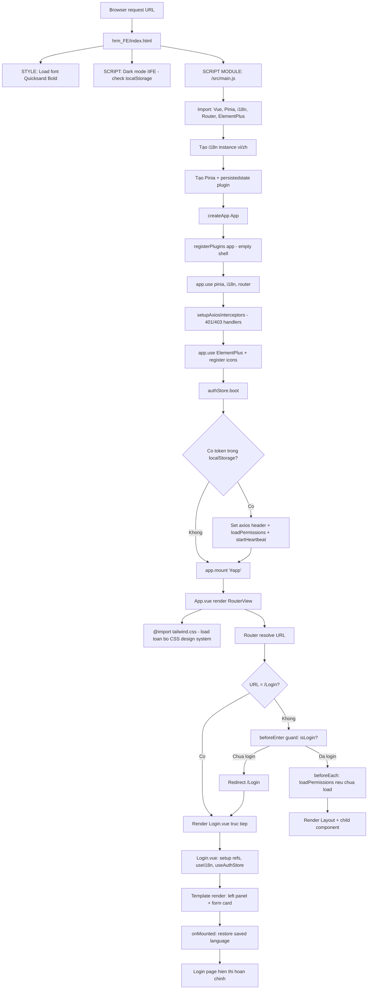
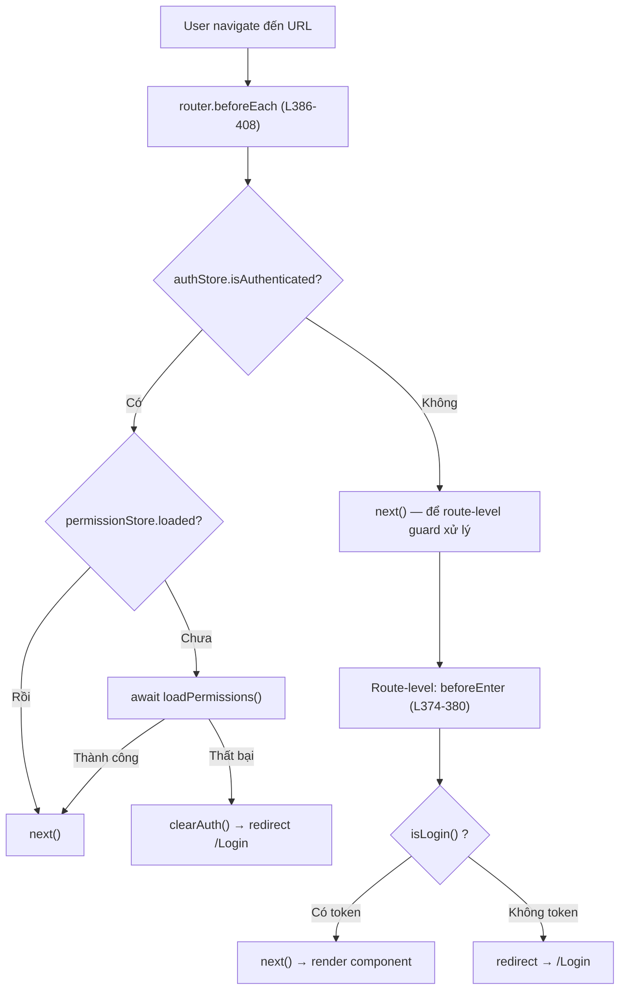
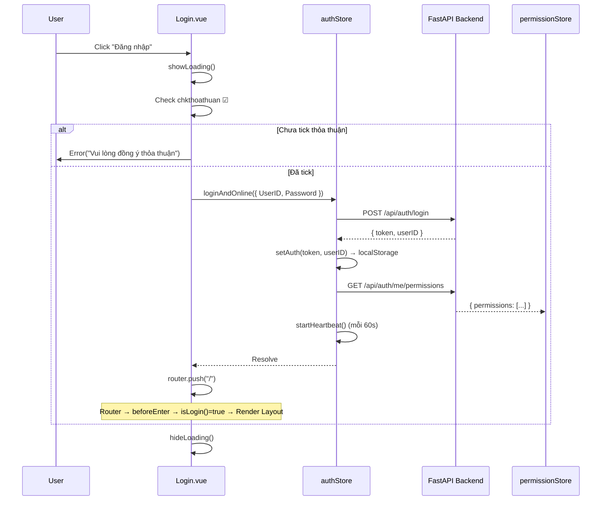

# HRM Frontend — Startup Flow

> Tài liệu này trace chính xác thứ tự code thực thi từ khi mở trình duyệt đến khi trang Login hiển thị hoàn chỉnh.
> Dành cho developer mới onboard vào project.

---

## Tổng quan



---

## Chi tiết từng bước

### Bước 1: Browser load `hrm_FE/index.html`

📁 **File:** [hrm_FE/index.html](file:///c:/Source/Gitea/HRM/hrm_FE/index.html)

Khi user truy cập bất kỳ URL nào, web server (Nginx/Vite dev) trả về `index.html`. Browser parse từ trên xuống dưới:

| Dòng       | Nội dung                                              | Mục đích                                     |
| ---------- | ----------------------------------------------------- | -------------------------------------------- |
| L1-28      | `<head>` — meta tags, PWA manifest, viewport          | SEO, PWA, responsive setup                   |
| L5         | `<link rel="icon" href="/logo.png">`                  | Favicon                                      |
| L8         | `<link rel="manifest" href="/manifest.json">`         | PWA manifest                                 |
| L27        | `<title>HRM</title>`                                  | Tab title                                    |
| L31        | `<div id="app"></div>`                                | Mount point cho Vue app                      |
| L32        | `<script type="module" src="/src/main.js">`           | Entry point — Vite sẽ bundle từ đây          |
| **L36-42** | **`<style>` — @font-face Quicksand Bold**             | **Load custom font từ assets**               |
| **L44-50** | **`<style>` — html { height, overflow, background }** | **CSS gốc cho `<html>`, dùng CSS variables** |
| **L52-59** | **`<style>` — \* { font-family: Quicksand Bold }**    | **Global font**                              |
| **L61-68** | **`<script>` — Dark mode IIFE**                       | **Chạy ĐỒNG BỘ trước mọi thứ để tránh FOUC** |

> [!IMPORTANT]
> **Dark mode IIFE** (L63-66) chạy đồng bộ, TRƯỚC khi Vue load. Nó check `localStorage.getItem("hrm-dark-mode")` và thêm class `dark` vào `<html>`. Điều này ngăn hiện tượng **FOUC** (Flash of Unstyled Content) — user sẽ không thấy flash trắng khi đang dùng dark mode.

---

### Bước 2: `src/main.js` — Bootstrap Vue Application

📁 **File:** [src/main.js](file:///c:/Source/Gitea/HRM/hrm_FE/src/main.js) (55 dòng)

Đây là file quan trọng nhất — nơi toàn bộ Vue app được khởi tạo:

```
L1-14:   Import tất cả dependencies
L16-26:  Tạo i18n instance (vi/zh), đọc locale từ localStorage
L28-29:  Tạo Pinia store + persistedstate plugin
L30:     createApp(App) — tạo Vue instance với App.vue làm root component
L31:     registerPlugins(app) — gọi plugins/index.js (hiện là empty shell)
L32:     app.use(pinia) — cài Pinia
L33:     app.use(i18n) — cài i18n
L34:     app.use(router) — cài Vue Router
L37-38:  setupAxiosInterceptors() — đăng ký interceptors cho 401/403/500
L40-42:  app.use(ElementPlus) — cài EP với locale vi hoặc zh
L43-45:  Register tất cả EP icons (el-icon-*)

L47-55:  ⭐ ASYNC BOOT SEQUENCE ⭐
         1. useAuthStore() — lấy auth store
         2. await authStore.boot() — khôi phục auth state
         3. app.mount("#app") — mount Vue vào DOM
```

> [!IMPORTANT]
> **`authStore.boot()` chạy TRƯỚC `app.mount()`**. Đây là quyết định thiết kế quan trọng: permissions phải được load trước khi render side menu, nếu không menu sẽ hiển thị rồi mới ẩn/hiện — gây nhấp nháy UI.

---

### Bước 3: `authStore.boot()` — Khôi phục Auth State

📁 **File:** [src/stores/authStores.js](file:///c:/Source/Gitea/HRM/hrm_FE/src/stores/authStores.js) — function [boot()](file:///c:/Source/Gitea/HRM/hrm_FE/src/stores/authStores.js#L28-L39)

```javascript
async function boot() {
  // Pinia persistedstate đã restore token/userID từ localStorage
  if (!token.value || !userID.value) return; // ← Nếu chưa login, return ngay
  axios.defaults.headers.common["Authorization"] = `Bearer ${token.value}`;

  const permissionStore = usePermissionStore();
  await permissionStore.loadPermissions(); // ← GET /api/auth/me/permissions

  startHeartbeat(); // ← Bắt đầu gửi heartbeat mỗi 60s
}
```

**2 nhánh có thể xảy ra:**

| Trường hợp                 | Token trong localStorage | Hành vi                                                                      |
| -------------------------- | ------------------------ | ---------------------------------------------------------------------------- |
| **User mới / chưa login**  | Không có                 | `boot()` return ngay → `app.mount()`                                         |
| **User đã login trước đó** | Có                       | Set axios header → load permissions từ API → start heartbeat → `app.mount()` |

---

### Bước 4: `app.mount("#app")` → `App.vue`

📁 **File:** [src/App.vue](file:///c:/Source/Gitea/HRM/hrm_FE/src/App.vue) (12 dòng)

```vue
<template>
  <RouterView></RouterView>
  <!-- L2: Render component theo URL -->
</template>

<script setup>
import { RouterView } from "vue-router";
</script>

<style>
@import "./styles/tailwind.css";     <!-- L10: Load TOÀN BỘ CSS design system -->
</style>
```

App.vue cực kỳ đơn giản — chỉ có `<RouterView>` và import CSS. Mọi logic đã được xử lý ở `main.js` và `router`.

---

### Bước 5: Router resolve → Điều hướng

📁 **File:** [src/router/index.ts](file:///c:/Source/Gitea/HRM/hrm_FE/src/router/index.ts) (415 dòng)

Router có 2 route chính:

```text
/Login       → Login.vue (không cần auth)          L70-74
/            → Layout component (cần auth)         L75-381
  ├── /              → General.vue (dashboard)
  ├── /guide         → Guide.vue
  ├── /nhansu/...    → Các component nhân sự
  ├── /chamcong/...  → Các component chấm công
  ├── /danhgia/...   → Các component đánh giá
  ├── /tinhluong/... → Các component tính lương
  └── /baocao/...    → Các component báo cáo
```

**Navigation Guards — Thứ tự thực thi:**



> [!NOTE]
> **`beforeEach` (global)** chạy TRƯỚC **`beforeEnter` (route-level)**. Với URL `/Login`, `beforeEach` gọi `next()` ngay (vì chưa auth) và `/Login` route không có `beforeEnter` nên Login.vue render trực tiếp.

---

### Bước 6: `Login.vue` — Render trang đăng nhập

📁 **File:** [src/Layout/Login.vue](file:///c:/Source/Gitea/HRM/hrm_FE/src/Layout/Login.vue) (627 dòng)

**`<script setup>` thực thi (L159-232):**

```
L160-168:  Import dependencies (router, authStore, PdfViewer, icons, i18n, flags)
L170-179:  Khởi tạo reactive refs:
           - showPassword = ref(true)
           - UserID = ref("")
           - Password = ref("")
           - chkthoathuan = ref(false)
           - lang = ref(localStorage.getItem("locale") || "vi")
           - showDialog = ref(false)

L181-194:  Khai báo functions: openPdf, onDialogOpened, HandleShowPassWord
L196-220:  handleLogin() — logic xử lý đăng nhập
L222-226:  onLangChange() — đổi ngôn ngữ

L228-231:  onMounted() — restore saved language từ localStorage
```

**Template render (L1-157) — Layout split 3 phần:**

```
┌────────────────────────────────────────────────────┐
│                    login-split                      │
│  ┌──────────────┐ ┌──────────────┐                 │
│  │  LEFT PANEL   │ │ RIGHT PANEL  │                 │
│  │  (Navy blue)  │ │ (Light gray) │                 │
│  │              │ │              │                 │
│  │  Logo + Name  │ │              │                 │
│  │  Tagline     │ │              │                 │
│  │  Description │ │              │                 │
│  │  Chips       │ │              │                 │
│  │  Footer      │ │              │                 │
│  └──────────────┘ └──────────────┘                 │
│          ┌──────────────────┐                       │
│          │   FORM OVERLAY    │  ← absolute center   │
│          │   (Glass card)    │                       │
│          │  🌐 Lang switch   │                       │
│          │  Heading          │                       │
│          │  [UserID input]   │                       │
│          │  [Password input] │                       │
│          │  ☑ Thỏa thuận     │                       │
│          │  [Đăng nhập btn]  │                       │
│          └──────────────────┘                       │
└────────────────────────────────────────────────────┘
```

**`onMounted()` chạy → restore ngôn ngữ → ✅ Login page hiển thị hoàn chỉnh!**

---

## Login Flow — Khi user nhấn "Đăng nhập"

📁 **File:** [src/Layout/Login.vue → handleLogin()](file:///c:/Source/Gitea/HRM/hrm_FE/src/Layout/Login.vue#L196-L220)



---

## Tổng kết file order

| #   | File                                                                                              | Dòng quan trọng            | Vai trò                                            |
| --- | ------------------------------------------------------------------------------------------------- | -------------------------- | -------------------------------------------------- |
| 1   | [hrm_FE/index.html](file:///c:/Source/Gitea/HRM/hrm_FE/index.html)                                | L31, L32, L61-68           | HTML shell, mount point, dark mode IIFE            |
| 2   | [src/main.js](file:///c:/Source/Gitea/HRM/hrm_FE/src/main.js)                                     | L16-34, L47-55             | Bootstrap: Vue + Pinia + i18n + Router + EP        |
| 3   | [src/plugins/index.js](file:///c:/Source/Gitea/HRM/hrm_FE/src/plugins/index.js)                   | L7-10                      | Empty shell (Vuetify đã gỡ)                        |
| 4   | [src/utils/axiosInterceptor.js](file:///c:/Source/Gitea/HRM/hrm_FE/src/utils/axiosInterceptor.js) | L11-75                     | Error handlers: 401→logout, 403→reload permissions |
| 5   | [src/stores/authStores.js](file:///c:/Source/Gitea/HRM/hrm_FE/src/stores/authStores.js)           | L28-39                     | boot: restore token, load permissions, heartbeat   |
| 6   | [src/stores/permissionStore.js](file:///c:/Source/Gitea/HRM/hrm_FE/src/stores/permissionStore.js) | L14-36                     | loadPermissions: GET /api/auth/me/permissions      |
| 7   | [src/App.vue](file:///c:/Source/Gitea/HRM/hrm_FE/src/App.vue)                                     | L2, L10                    | RouterView + import tailwind.css                   |
| 8   | [src/router/index.ts](file:///c:/Source/Gitea/HRM/hrm_FE/src/router/index.ts)                     | L70-74, L374-380, L386-408 | Routes + beforeEnter + beforeEach guards           |
| 9   | [src/Layout/Login.vue](file:///c:/Source/Gitea/HRM/hrm_FE/src/Layout/Login.vue)                   | L159-231                   | Login form UI + handleLogin + onMounted            |

---

> **Đọc xong tài liệu này, developer mới sẽ hiểu:**
>
> 1. Code bắt đầu chạy từ đâu (`index.html` L31-32)
> 2. Tại sao `boot()` chạy trước `mount()` (tránh nhấp nháy menu)
> 3. Router guards hoạt động ra sao (global → route-level)
> 4. Login page gồm những gì và được render thế nào
> 5. Sau khi login thành công, flow tiếp theo ra sao
