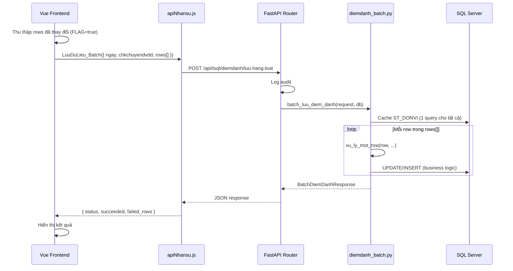
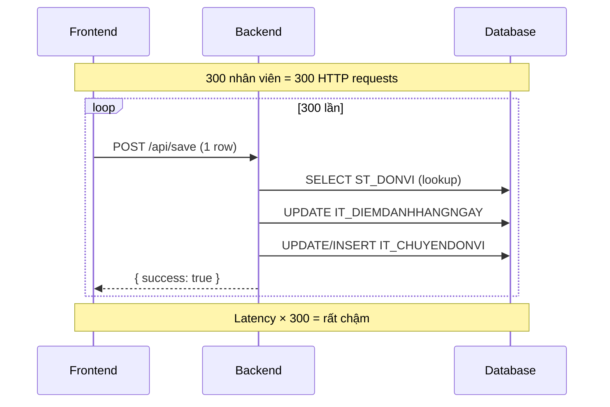
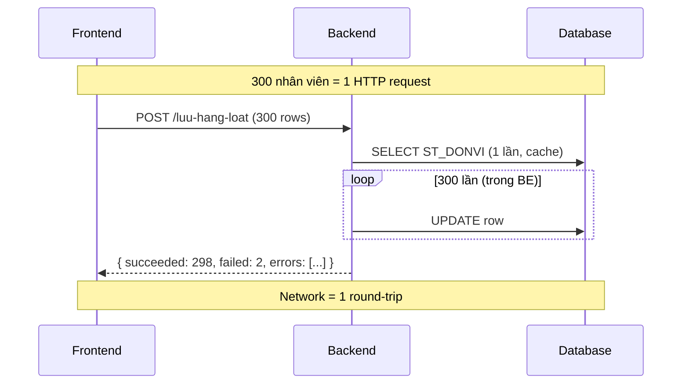

# Kiến Trúc Batch Save - Điểm Danh Hằng Ngày

## Tổng Quan

Module **Điểm Danh Hằng Ngày** cho phép user chấm công cho hàng trăm nhân viên trên 1 grid. Khi nhấn "Lưu", toàn bộ dữ liệu được gửi qua **1 request duy nhất** (Batch) thay vì gọi API từng dòng.

---

## Kiến Trúc Tổng Thể



---

## Chi Tiết Từng Layer

### 1. Frontend — [DiemDanhHangNgay.vue](file:///c:/Source/Gitea/HRM/hrm_FE/src/components/NHANSU/DiemDanhHangNgay.vue)

- Grid hiển thị 300+ nhân viên với các checkbox (DILAM, P, R, O, NVG...) và select (DV_DIEUDONG)
- Khi user thay đổi ô nào, hàm [onCellChange](file:///c:/Source/Gitea/HRM/hrm_FE/src/components/NHANSU/DiemDanhHangNgay.vue#778-851) đánh dấu `row.FLAG = true`
- Khi nhấn "Lưu", FE **lọc ra chỉ các rows có FLAG=true**, đóng gói thành 1 payload

```javascript
// Payload gửi đi
{
  ngay: "2024-12-12",
  chkchuyendvdd: true,           // checkbox "Chuyển đơn vị"
  rows: [                        // Chỉ các rows đã thay đổi
    { NV_MA: "001031", DV_MA: "IT", DILAM: true, P: false, ... },
    { NV_MA: "001032", DV_MA: "HR", DILAM: false, NVG: true, ... },
    // ...N rows
  ]
}
```

### 2. API Layer — [apiNhansu.js](file:///c:/Source/Gitea/HRM/hrm_FE/src/apis/apiNhansu.js#L547-L571)

```javascript
export const LuuDuLieu_Batch = async (payload) => {
  return await axios.post(
    `/api/tsql/diemdanh/luu-hang-loat`,
    payload,
    { timeout: 0 }  // Không timeout vì có thể chạy lâu (300+ rows)
  );
};
```

> [!IMPORTANT]
> `timeout: 0` = **không giới hạn** thời gian chờ. Cần thiết vì batch xử lý 300+ rows có thể mất 5-10 giây.

### 3. Backend Router — [tsql.py](file:///c:/Source/Gitea/HRM/hrm_BE/app/routers/tsql.py#L694-L751)

```python
@router.post("/diemdanh/luu-hang-loat", response_model=BatchDiemDanhResponse)
def luu_diem_danh_hang_loat(request: BatchDiemDanhRequest, ...):
    log_audit(...)  # Ghi log ai làm gì
    return batch_luu_diem_danh(request, db)
```

### 4. Batch Service — [diemdanh_batch.py](file:///c:/Source/Gitea/HRM/hrm_BE/app/batch/diemdanh_batch.py)

Đây là **trái tim** của pattern. Gồm 2 phần chính:

#### a) [batch_luu_diem_danh()](file:///c:/Source/Gitea/HRM/hrm_BE/app/batch/diemdanh_batch.py#342-410) — Orchestrator (dòng 342-409)

```python
def batch_luu_diem_danh(request, db):
    # 1. Cache ST_DONVI (1 query duy nhất cho TẤT CẢ rows)
    donvi_rows = fetch_all(db, "SELECT DV_MA, X_MA_, N_MA FROM ST_DONVI", {})
    donvi_map = {row['DV_MA']: row for row in donvi_rows}

    # 2. Lặp qua từng row - mỗi row xử lý độc lập
    for row in request.rows:
        try:
            result = xu_ly_mot_row(row, ngay, chkchuyendvdd, db, donvi_map)
            if result["success"]:
                results.succeeded += 1
            else:
                results.failed_rows.append(row.NV_MA)
        except Exception:
            results.failed_rows.append(row.NV_MA)  # Row lỗi không dừng batch!

    return results  # Trả về kết quả tổng hợp
```

> [!TIP]
> **Cache `donvi_map`** là kỹ thuật quan trọng: thay vì mỗi row query `ST_DONVI` 1 lần (300 queries), ta query 1 lần rồi tra cứu bằng dict (O(1) lookup).

#### b) [xu_ly_mot_row()](file:///c:/Source/Gitea/HRM/hrm_BE/app/batch/diemdanh_batch.py#102-340) — Business Logic cho 1 nhân viên (dòng 102-339)

Xử lý 7 bước logic cho mỗi row:

| Bước | Mô tả | Bảng ảnh hưởng |
|------|-------|----------------|
| 1 | Xử lý nghỉ việc (NVG/OPKTRG) | `ST_NHANVIEN`, `IT_DIEMDANHHANGNGAY` |
| 2 | Xử lý điều động đơn vị | `IT_THEODOINHANSU` |
| 3 | Xác định Xưởng/Ngành + Tăng/Giảm | `ST_DONVI` (từ cache) |
| 4 | **Lưu chính** vào bảng điểm danh | `IT_DIEMDANHHANGNGAY` |
| 5 | Cập nhật chuyển đơn vị tạm | `IT_CHUYENDONVI` |
| 6 | Cập nhật chuyển đơn vị chính thức | `ST_CHUYENDONVI`, `ST_NHANVIEN` |
| 7 | Cập nhật DDG/DDT theo dõi nhân sự | `IT_THEODOINHANSU` |

### 5. Pydantic Models — Validate dữ liệu

```python
class DiemDanhRow(BaseModel):      # 1 dòng điểm danh
    NV_MA: str
    DV_MA: str
    DILAM: bool = False
    P: bool = False
    # ...19 fields

class BatchDiemDanhRequest(BaseModel):  # Request gửi lên
    ngay: str
    chkchuyendvdd: bool
    rows: List[DiemDanhRow]         # Nhiều rows

class BatchDiemDanhResponse(BaseModel): # Response trả về
    status: str                      # "success" | "partial_success" | "error"
    succeeded: int
    failed_rows: List[str]
    errors: List[Dict[str, str]]
```

---

## So Sánh: Batch vs Không Batch

### ❌ Không dùng Batch (Row-by-row)



| Metric | Không Batch | Có Batch |
|--------|------------|----------|
| **HTTP requests** | 300 | **1** |
| **Network round-trips** | 300 lần | **1 lần** |
| **Query ST_DONVI** | 300 lần | **1 lần (cached)** |
| **Connection overhead** | 300 lần open/close | **1 session** |
| **Thời gian (300 rows)** | ~30-60s | **~2-5s** |
| **Error handling** | Mỗi row phải xử lý riêng ở FE | **BE tổng hợp, FE nhận 1 response** |
| **UX** | Loading bar chạy 300 lần | **Loading 1 lần, hiện kết quả tổng** |


### ✅ Có dùng Batch (1 request)



---

## Lợi Ích Kỹ Thuật Cụ Thể

### 1. Giảm Network Latency
```
Không batch: 300 requests × 50ms/request = 15,000ms (15s chỉ riêng network)
Có batch:    1 request × 50ms = 50ms network + ~3s xử lý = ~3s
```

### 2. Cache một lần, dùng nhiều lần
```python
# Không batch: MỖI row query lại ST_DONVI
for row in rows:
    donvi = db.execute("SELECT ... FROM ST_DONVI WHERE DV_MA = :dv", ...)  # × 300 lần

# Có batch: Query 1 lần, dùng dict lookup O(1)
donvi_map = {row['DV_MA']: row for row in fetch_all("SELECT ... FROM ST_DONVI")}
for row in rows:
    donvi = donvi_map.get(row.DV_MA)  # O(1) lookup, 0 query
```

### 3. Partial Success — Row lỗi không ảnh hưởng row khác

```python
for row in request.rows:
    try:
        result = xu_ly_mot_row(row, ...)
    except Exception:
        results.failed_rows.append(row.NV_MA)  # Ghi lại row lỗi
        # KHÔNG raise → tiếp tục xử lý row tiếp theo
```

Response trả về chi tiết:
```json
{
  "status": "partial_success",
  "message": "Đã xử lý 298/300 dòng, 2 dòng lỗi",
  "succeeded": 298,
  "failed_rows": ["001045", "001089"],
  "errors": [
    { "NV_MA": "001045", "error": "DV_MA not found" },
    { "NV_MA": "001089", "error": "Duplicate key" }
  ]
}
```

### 4. Pydantic Validation — Validate trước khi xử lý

```python
class DiemDanhRow(BaseModel):
    NV_MA: str          # Bắt buộc
    DILAM: bool = False # Có default

# Nếu FE gửi sai format → FastAPI tự trả 422 Unprocessable Entity
# Không cần viết validation thủ công
```

---

## Tóm Tắt Pattern

```
┌─────────────────────────────────────────────────────┐
│  BATCH PATTERN FLOW                                 │
│                                                     │
│  1. FE: Thu thập changed rows (FLAG=true)           │
│  2. FE: Gọi 1 API duy nhất với toàn bộ rows        │
│  3. BE: Validate bằng Pydantic                      │
│  4. BE: Cache shared data (ST_DONVI → dict)         │
│  5. BE: Loop xử lý từng row, catch lỗi độc lập     │
│  6. BE: Trả response tổng hợp (succeeded/failed)   │
│  7. FE: Hiển thị kết quả cho user                   │
└─────────────────────────────────────────────────────┘
```

> [!NOTE]
> Pattern này có thể áp dụng cho bất kỳ module nào cần lưu hàng loạt: Chấm Công, Nghỉ Phép, Đánh Giá... Trong project này, ta đã áp dụng tương tự cho **Chấm Công Trong** (`/chamcong/vaora-hang-loat`) và **Chấm Công Ngoài** (`/chamcong/vaorangoai-hang-loat`).
